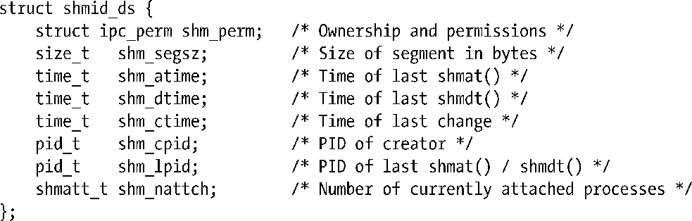

### 48.8　共享内存关联数据结构

每个共享内存段都有一个关联的shmid_ds数据结构，其形式如下。

SUSv3要求实现提供上面给出的所有字段。其他一些UNIX实现在shmid_ds结构中包含了额外的非标准字段。

各种共享内存系统调用会隐式地更新shmid_ds结构中的字段，使用shmctl() IPC_SET操作可以显式地更新shm_perm字段中的特定子字段。细节信息如下。

##### shm_perm

在创建共享内存段之后会像45.3节中描述的那样对这个子结构中的字段进行初始化。uid、gid 以及（低 9 位）mode子字段是通过IPC_SET来更新的。除了常规的权限位之外，shm_perm.mode字段还有两个只读位掩码标记。其中第一个是SHM_DEST（销毁），它表示当所有进程的地址空间都与该段分离之后是否将该段标记为删除（通过shmctl() IPC_RMID操作）。另一个标记是SHM_LOCKED，它表示是否将段锁进物理内存中（通过shmctl() SHM_LOCK操作）。这两个标记都没有在SUSv3中被标准化，并且只有一些UNIX实现提供了与这两个标记等价的标记，同时有些实现上的名称也是不同的。

##### shm_segsz

在创建共享内存段时这个字段会被设置成段所需要的字节数（即shmget()调用中size参数的值）。在48.2节中提到过共享内存是以分页为单位来分配的，因此段所需的实际大小可能会大于这个值。

##### shm_atime

在创建共享内存段时会将这个字段设置为0，当一个进程附加该段时（shmat()）会将这个字段设置为当前时间。这个字段以及shmid_ds结构中的另一个时间戳字段的类型为time_t，它们存储着自新纪元到现在的秒数。

##### shm_dtime

在创建共享内存段时会将这个字段设置为0，当一个进程与该段分离（shmdt()）之后会将这个字段设置为当前时间。

##### shm_ctime

当段被创建时以及每个成功的IPC_SET操作都会将这个字段设置为当前时间。

##### shm_cpid

这个字段会被设置成使用shmget()创建这个段的进程的进程ID。

##### shm_lpid

在创建共享内存段时会将这个字段设置为0，后续每个成功的shmat()或shmdt()调用会将这个字段设置成调用进程的进程ID。

##### shm_nattch

这个字段统计当前附加该段的进程数。在创建段时会将这个字段初始化为0，然后每次成功的shmat()调用会递增这个字段的值，每次成功的shmdt()调用会递减这个字段的值。用来定义这个字段的shmatt_t数据类型是一个无符号整型，SUSv3要求这个类型的大小最少为unsigned short。（在Linux上这个类型被定义成了unsigned long。）

