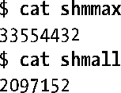
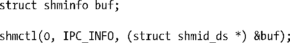

### 48.9　共享内存的限制

大多数UNIX实现会对System V共享内存施加各种各样的限制。下面是一份Linux共享内存的限制列表。括号中列出了当限制达到时受影响的系统调用及其返回的错误。

##### SHMMNI

这是一个系统级别的限制，它限制了所能创建的共享内存标识符（换句话说是共享内存段）的数量。（shmget(), ENOSPC）

##### SHMMIN

这个一个共享内存段的最小大小（字节数）。这个限制的值被定义成了1（无法修改这个值），但实际的限制是系统分页大小（shmget(), EINVAL）。

##### SHMMAX

这个是一个共享内存段的最大大小（字节数）。SHMMAX的实际上限依赖于可用的RAM和交换空间。（shmget(), EINVAL）

##### SHMALL

这是一个系统级别的限制，它限制了共享内存中的分页总数。其他大多数UNIX实现并没有提供这个限制。SHMALL的实际上限依赖于可用的RAM和交换空间。（shmget(), ENOSPC）

其他一些UNIX实现还施加了下列限制（Linux并没有实现这些限制）。

##### SHMSEG

这个是进程级别的限制，它限制了所能附加的共享内存段数量。

在系统启动时共享内存限制会被设置成默认值。（这些默认值在不同的内核版本中可能存在差异，一些发行厂商发行的内核中的默认设置与vanilla内核中的默认设置是不同的。）在Linux上，可以通过/proc文件系统中的文件来查看其中一些限制。表48-2列出了与各个限制对应的/proc文件。下面是Linux 2.6.31在x86-32系统上的默认限制。

Linux特有的shmctl() IPC_INFO操作返回一个类型为shminfo的结构，它包含了各个共享内存限制的值。

相关的Linux特有的SHM_INFO操作返回一个类型为shm_info的结构，它包含了共享内存对象所消耗的实际资源相关的信息。本书随带的源代码的svshm/svshm_info.c文件中提供了一个使用SHM_INFO的例子。

有关IPC_INFO、SHM_INFO以及shminfo和shm_info结构的细节可以在shmctl(2)手册中找到。

<b class="my_markdown">表48-2：System V共享内存限制</b>

| 限　　制 | 最大值（x86-32） | /proc/sys/kernel中对应的文件 |
| :-----  | :-----  | :-----  | :-----  | :-----  |
| SHMMNI | SHMMAX | SHMALL | 32768 (IPCMNI) | 依赖于可用内存 | 依赖于可用内存 | shmmni | shmmax | shmall |

