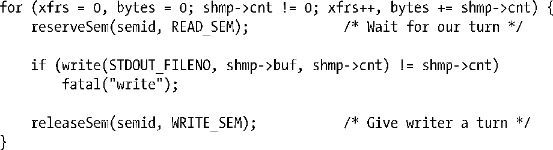

### 48.11　习题

**48-1.** 　使用事件标记来替换程序清单48-2（svshm_xfr_writer.c）和程序清单48-3（svshm_xfr_reader.c）中的二元信号量。

**48-2.** 　解释为何程序清单48-3在for循环被修改成如下形式时会错误地报告了传输字节数。

**48-3.** 　尝试为程序清单48-2（svshm_xfr_writer.c）和程序清单48-3（svshm_xfr_reader.c）中的程序中用来交换数据的缓冲区指定不同大小（由常量BUF_SIZE定义）并编译这两个程序。记录在各种缓冲区大小下svshm_xfr_reader.c的执行时间。

**48-4.** 　编写一个程序显示与共享内存段关联的shmid_ds数据结构（48,8节）中的内容。段的标识符应该通过命令行参数来指定。（参见程序清单47-3中的程序，它在System V信号量上执行了一个类似的任务。）

**48-5.** 　编写一个目录服务使之使用一个共享内存段来发布名称-值对。程序需要提供一个API来允许调用者创建新名称、修改一个既有名称、删除一个既有名称以及获取与一个名称相关联的值。使用信号量来确保一个执行共享内存段更新操作的进程能够互斥地访问段。

**48-6.** 　编写一个程序（类似于程序清单46-6中的程序）使之使用shmctl() SHM_INFO和SHM_STAT操作来获取和显示系统中所有共享内存段列表。

