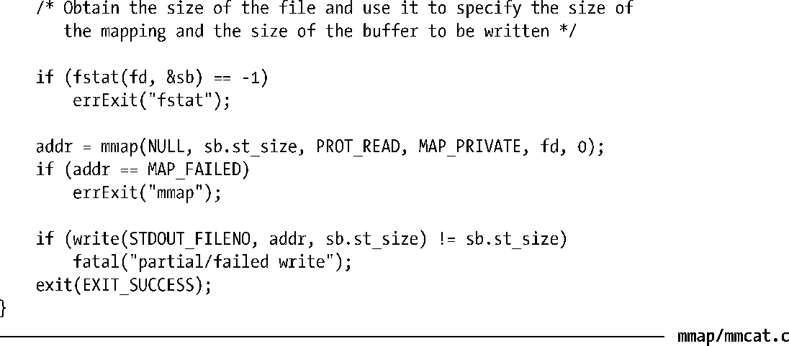

### 49.2　创建一个映射：mmap()

mmap()系统调用在调用进程的虚拟地址空间中创建一个新映射。

addr参数指定了映射被放置的虚拟地址。如果将addr指定为NULL，那么内核会为映射选择一个合适的地址。这是创建映射的首选做法。或者在addr中指定一个非NULL值时，内核会在选择将映射放置在何处时将这个参数值作为一个提示信息来处理。在实践中，内核至少会将指定的地址舍入到最近的一个分页边界处。不管采用何种方式，内核会选择一个不与任何既有映射冲突的地址。（如果在flags包含了MAP_FIXED，那么addr必须是分页对齐的。在49.10节中将会对这个标记进行介绍。）

成功时mmap()会返回新映射的起始地址。发生错误时mmap()会返回MAP_FAILED。

> 在Linux（以及大多数其他UNIX实现）上，MAP_FAILED常量等同于((void *) –1)。但SUSv3规定了这个常量值，因为C标准无法确保能够将((void *) –1)与成功的mmap()调用的返回值区分开来。

length参数指定了映射的字节数。尽管length无需是一个系统分页大小（sysconf(_SC_PAGESIZE)返回值）的倍数，但内核会以分页大小为单位来创建映射，因此实际上length会被向上提升为分页大小的下一个倍数。

prot参数是一个位掩码，它指定了施加于映射之上的保护信息，其取值要么是PROT_NONE，要么是表49-2中列出的其他三个标记的组合（取OR）。

<b class="my_markdown">表49-2：内存保护值</b>

| 值 | 描　　述 |
| :-----  | :-----  | :-----  | :-----  |
| PROT_NONE | 区域无法访问 |
| PROT_READ | PROT_WRITE | PROT_EXEC | 区域内容可读取 | 区域内容可修改 | 区域内容可执行 |

flags参数是一个控制映射操作各个方面的选项的位掩码。这个掩码必须只包含下列值中一个。

##### MAP_PRIVATE

创建一个私有映射。区域中内容上所发生的变更对使用同一映射的其他进程是不可见的，对于文件映射来讲，所发生的变更将不会反应在底层文件上。

##### MAP_SHARED

创建一个共享映射。区域中内容上所发生的变更对使用MAP_SHARED特性映射同一区域的进程是可见的，对于文件映射来讲，所发生的变更将直接反应在底层文件上。对文件的更新将无法确保立即生效，具体可参加49.5节中对msync()系统调用的介绍。

除了MAP_PRIVATE和MAP_SHARED之外，在flags中还可以有选择地对其他标记取OR。在49.6和49.10节中将会对这些标记进行介绍。

剩余的参数fd和offset是用于文件映射的（匿名映射将忽略它们）。fd参数是一个标识被映射的文件的文件描述符。offset参数指定了映射在文件中的起点，它必须是系统分页大小的倍数。要映射整个文件就需要将offset指定为0并且将length指定为文件大小。在49.5节中将会介绍更多有关文件映射的内容。

#### 有关内存保护的更多细节

前面提过mmap() prot参数指定了新内存映射上的保护信息。这个参数可以取PROT_NONE或者PROT_READ、PROT_WRITE、以及PROT_EXEC中一个或多个标记的掩码。如果一个进程在访问一个内存区域时违反了该区域上的保护位，那么内核会向该进程发送一个SIGSEGV信号。

> 尽管SUSv3规定SIGSEGV应该被用来通知内存保护违背，但在一些实现上使用的则是SIGBUS。

标记为PROT_NONE的分页内存的一个用途是作为一个进程分配的内存区域的起始位置或结束位置的守护分页。如果进程意外地访问了其中一个被标记为PROT_NONE的分页，那么内核会通过生成一个SIGSEGV信号来通知该进程这样一个事实。

内存保护信息驻留在进程私有的虚拟内存表中。因此，不同的进程可能会使用不同的保护位来映射同一个内存区域。

使用mprotect()系统调用（50.1节）能够修改内存保护位。

在一些UNIX实现上，实际施加于一个映射分页上的保护位于在prot中指定的信息可能不完全一致。特别地，底层硬件在保护粒度上的限制（如老式的x86-32架构）意味着在很多UNIX实现上PROT_READ会隐含PROT_EXEC，反之亦然，并且在一些实现上指定PROT_WRITE会隐含PROT_READ。但应用程序不应该依赖于这种行为；prot指定的信息应该总是与所需的内存保护信息一致。

> 现代x86-32架构为将页表标记为NX（no execute）提供了硬件支持，并且自内核2.6.8起，Linux利用这个特性来合适地分隔Linux/x86-32上的PROT_READ和PROT_EXEC权限。

#### 标准中规定的对offset和addr的对齐约束

SUSv3规定mmap()的offset参数必须要与分页对齐，而addr参数在指定了MAP_FIXED的情况下也必须要与分页对齐。Linux遵循了这些要求，但后面又发现SUSv3的要求与之前的标准提出的要求是不同的，之前的标准对这些参数的要求要低一些。SUSv3中的措辞会（不必要地）导致一些之前符合标准的实现变得不符合标准了。SUSv4则放宽了这方面的要求：

+ 一个实现可能会要求offset为系统分页大小的倍数。
+ 如果指定了MAP_FIXED，那么一个实现可能会要求addr是分页对齐的。
+ 如果指定了MAP_FIXED并且addr为非零值，那么addr和offset除以系统分页大小所得的余数应该相等。

> mprotect()、msync()以及munmap()中的addr参数也存在类似的情况。SUSv3规定这个参数必须是分页对齐的。SUSv4表示一个实现可以要求这个参数是分页对齐的。

#### 示例程序

程序清单49-1演示了如何使用mmap()来创建一个私有文件映射。这个程序是一个简单版本的cat(1)，它将映射通过命令行参数指定的（整个）文件，然后将映射中的内容写入到标准输出中。

程序清单49-1：使用mmap()创建一个私有文件映射

