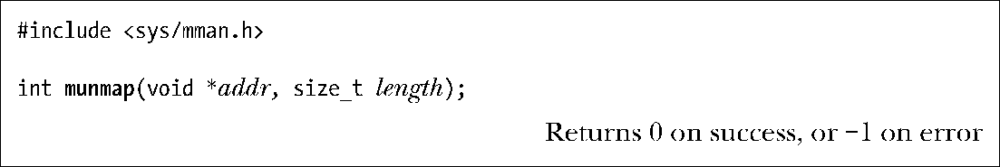
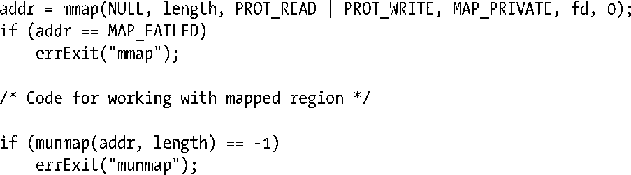

### 49.3　解除映射区域：munmap()

munmap()系统调用执行与mmap()相反的操作，即从调用进程的虚拟地址空间中删除一个映射。

addr参数是待解除映射的地址范围的起始地址，它必须与一个分页边界对齐。（SUSv3规定addr必须是分页对齐的。SUSv4表示一个实现可以要求这个参数是分页对齐的。）

length参数是一个非负整数，它指定了待解除映射区域的大小（字节数）。范围为系统分页大小的下一个倍数的地址空间将会被解除映射。

一般来讲通常会解除整个映射。因此可以将addr指定为上一个mmap()调用返回的地址，并且length的值与mmap()调用中使用的length的值一样。下面是一个例子。

或者也可以解除一个映射中的部分映射，这样原来的映射要么会收缩，要么会被分成两个，这取决于在何处开始解除映射。还可以指定一个跨越多个映射的地址范围，这样的话所有在范围内的映射都会被解除。

如果在由addr和length指定的地址范围中不存在映射，那么munmap()将不起任何作用并返回0（表示成功）。

在解除映射期间，内核会删除进程持有的在指定地址范围内的所有内存锁。（内存锁是通过mlock()或mlockall()来建立的，50.2节将会对此予以介绍。）

当一个进程终止或执行了一个exec()之后进程中所有的映射会自动被解除。

为确保一个共享文件映射的内容会被写入到底层文件中，在使用munmap()解除一个映射之前需要调用msync()（参见49.5节）。

