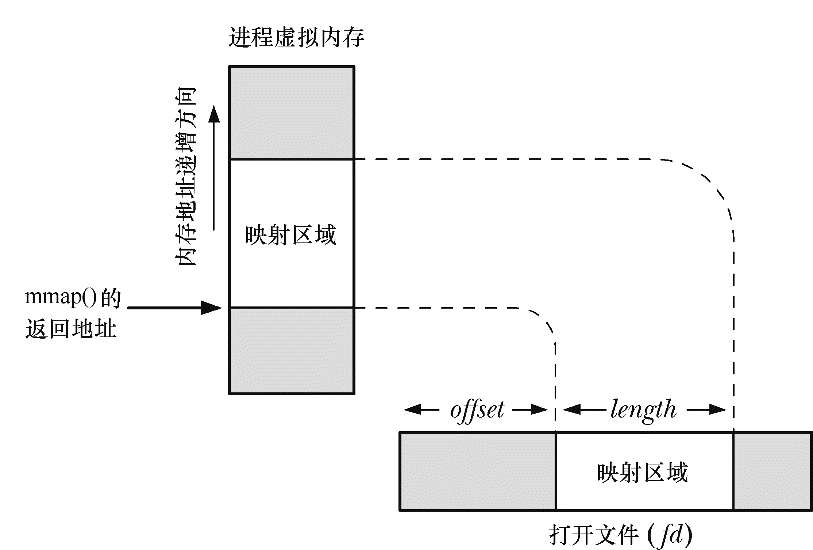

### 49.4　文件映射

要创建一个文件映射需要执行下面的步骤。

**1．** 获取文件的一个描述符，通常通过调用open()来完成。

**2．** 将文件描述符作为fd参数传入mmap()调用。

执行上述步骤之后mmap()会将打开的文件的内容映射到调用进程的地址空间中。一旦mmap()被调用之后就能够关闭文件描述符了，而不会对映射产生任何影响。但在一些情况下，将这个文件描述符保持在打开状态可能是有用的——如参见程序清单49-1以及参见第54章。

> 除了普通的磁盘文件，使用mmap()还能够映射各种真实和虚拟设备的内容，如硬盘、光盘以及/dev/mem。

在打开描述符fd引用的文件时必须要具备与prot和flags参数值匹配的权限。特别地，文件必须总是被打开以允许读取，并且如果在flags中指定了PROT_WRITE和MAP_SHARED，那么文件必须总是被打开以允许读取和写入。

offset参数指定了从文件区域中的哪个字节开始映射，它必须是系统分页大小的倍数。将offset指定为0会导致从文件的起始位置开始映射。length参数指定了映射的字节数。offset和length参数一起确定了文件的哪个区域会被映射进内存，如图49-1所示。

<b class="my_markdown">图49-1：内存映射文件概览</b>

> 在Linux上，一个文件映射的分页会在首次被访问时被映射进内存。这意味着如果在mmap()调用之后修改了文件区域，但映射的对应部分（即分页）还没有被访问过，那么如果相应分页还没有被加载进内存的话，变更对这个进程可能是可见的。这个行为是依赖于实现的，可移植的应用程序应该避免依赖某个特定内核在这种场景中的行为。

