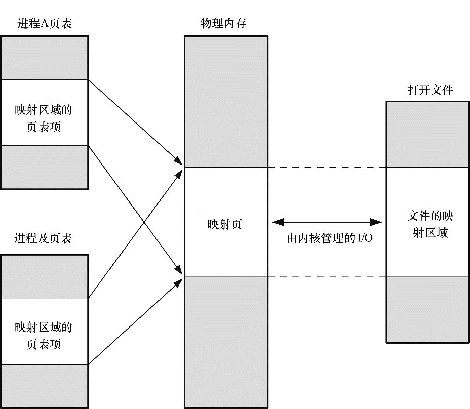
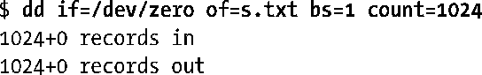
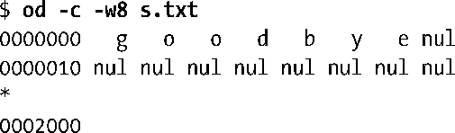
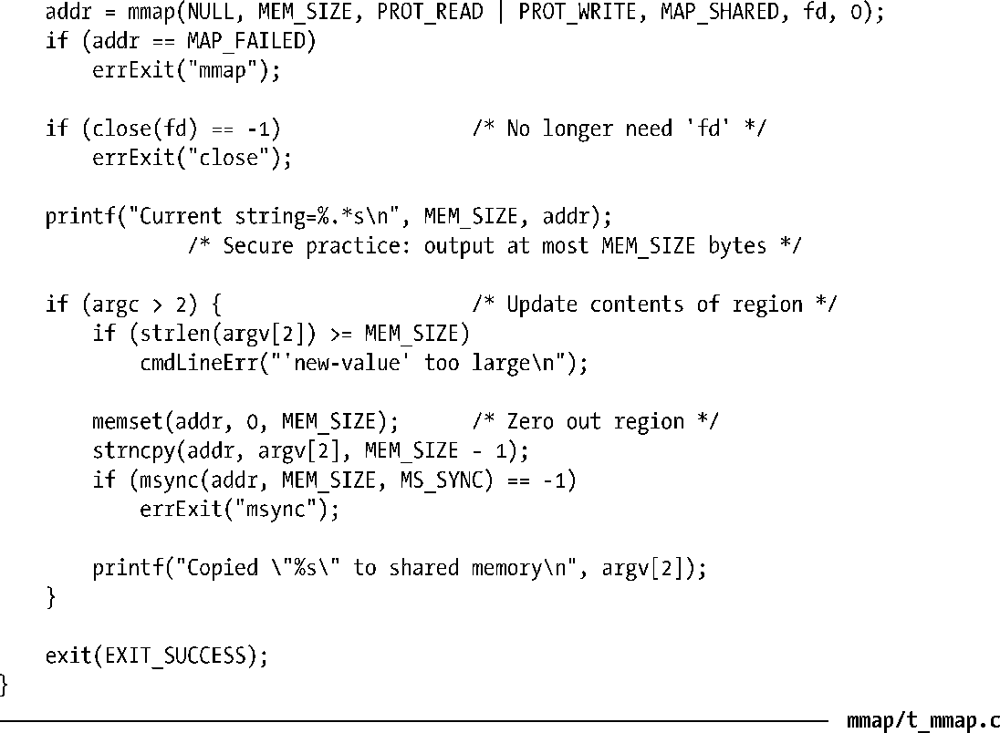

### 49.4.2　共享文件映射

当多个进程创建了同一个文件区域的共享映射时，它们会共享同样的内存物理分页。此外，对映射内容的变更将会反应到文件上。实际上，这个文件被当成了该块内存区域的分页存储，如图49-2所示。（这幅图是简化过的，它并没有指出映射分页在物理内存中通常是不连续的这样一个事实。）

<b class="my_markdown">图49-2：两个进程和一个文件的同一区域的共享映射</b>

共享文件映射存在两个用途：内存映射I/O和IPC。下面将分别介绍这两种用途。

#### 内存映射I/O

由于共享文件映射中的内容是从文件初始化而来的，并且对映射内容所做出的变更都会自动反应到文件上，因此可以简单地通过访问内存中的字节来执行文件I/O，而依靠内核来确保对内存的变更会被传递到映射文件中。（一般来讲，一个程序会定义一个结构化数据类型来与磁盘文件中的内容对应起来，然后使用该数据类型来转换映射的内容。）这项技术被称为内存映射I/O，它是使用read()和write()来访问文件内容这种方法的替代方案。

内存映射I/O具备两个潜在的优势。

+ 使用内存访问来取代read()和write()系统调用能够简化一些应用程序的逻辑。
+ 在一些情况下，它能够比使用传统的I/O系统调用执行文件I/O这种做法提供更好的性能。

内存映射I/O之所以能够带来性能优势的原因如下。

+ 正常的read()或write()需要两次传输：一次是在文件和内核高速缓冲区之间，另一次是在高速缓冲区和用户空间缓冲区之间。使用mmap()就无需第二次传输了。对于输入来讲，一旦内核将相应的文件块映射进内存之后用户进程就能够使用这些数据了。对于输出来讲，用户进程仅仅需要修改内存中的内容，然后可以依靠内核内存管理器来自动更新底层的文件。
+ 除了节省了内核空间和用户空间之间的一次传输之外，mmap()还能够通过减少所需使用的内存来提升性能。当使用read()或write()时，数据将被保存在两个缓冲区中：一个位于用户空间，另一个位于内核空间。当使用mmap()时，内核空间和用户空间会共享同一个缓冲区。此外，如果多个进程正在在同一个文件上执行I/O，那么它们通过使用mmap()就能够共享同一个内核缓冲区，从而又能够节省内存的消耗。

内存映射I/O所带来的性能优势在在大型文件中执行重复随机访问时最有可能体现出来。如果顺序地访问一个文件，并假设执行I/O时使用的缓冲区大小足够大以至于能够避免执行大量的I/O系统调用，那么与read()和write()相比，mmap()带来的性能上的提升就非常有限或者说根本就没有带来性能上的提升。性能提升的幅度之所以非常有限的原因是不管使用何种技术，整个文件的内容在磁盘和内存之间只传输一次，效率的提高主要得益于减少了用户空间和内核空间之间的一次数据传输，并且与磁盘I/O所需的时间相比，内存使用量的降低通常是可以忽略的。

> 内存映射I/O也有一些缺点。对于小数据量I/O来讲，内存映射I/O的开销（即映射、分页故障、解除映射以及更新硬件内存管理单元的超前转换缓冲器）实际上要比简单的read()或write()大。此外，有些时候内核难以高效地处理可写入映射的回写（在这种情况下，使用msync()或sync_file_range()有助于提高效率）。

#### 使用共享文件映射的IPC

由于所有使用同样文件区域的共享映射的进程共享同样的内存物理分页，因此共享文件映射的第二个用途是作为一种（快速的）IPC方法。这种共享内存区域与System V共享内存对象（第48章）之间的区别在于区域中内容上的变更会反应到底层的映射文件上。这种特性对那些需要共享内存内容在应用程序或系统重启时能够持久化的应用程序来讲是非常有用的。

#### 示例程序

程序清单49-2提供了一个简单的例子来演示如何使用mmap()创建一个共享文件映射。这个程序首先映射一个名称通过第一个命令行参数指定的文件，然后打印出映射区域起始位置的字符串值。最后，如果提供了第二个命令行参数，那么该字符串会被复制进共享内存区域中。

下面的shell会话日志演示了如何使用这个程序。下面首先创建了一个大小为1024字节的文件并在其中填满零。

然后使用程序映射这个文件并将一个字符串复制进映射区域中。

程序在打印当前字符串时不会显示任何内容，因为映射文件的初始值是以null字节打头的（即长度为零的字符串）。

接着再次使用程序映射这个文件并复制一个新字符串到映射区域中。

最后通过输出文件的内容来对其中的内容进行验证，每行显示了8个字符。

这个简单的程序没有使用任何机制来同步多个进程对映射文件的访问。但现实世界中的应用程序通常需要同步对共享映射的访问。这可以通过使用各种技术来完成，包括信号量（第47和53章）和文件加锁（第55章）。

在49.5节中将会对程序清单49-2中用到的msync()系统调用进行解释。

程序清单49-2：使用mmap()创建一个共享文件映射

