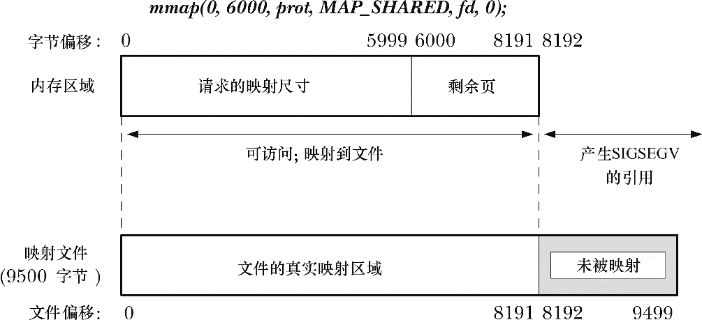

### 49.4.3　边界情况

在很多情况下，一个映射的大小是系统分页大小的整数倍，并且映射会完全落入映射文件的范围之内。但这种要求不是必需的，下面来看一下当这些条件不满足时会发生什么事情。

图49-3描绘了映射完全落入映射文件的范围之内但区域的大小并不是系统分页大小的一个整数倍的情况（在这个讨论中假设分页大小为4096字节）。

<b class="my_markdown">图49-3：length不是系统分页大小的整数倍的内存映射</b>

由于映射的大小不是系统分页大小的整数倍，因此它会被向上舍入到系统分页大小的下一个整数倍。由于文件的大小要大于这个被向上舍入的大小，因此文件中对应字节会像图49-3中那样被映射。

试图访问映射结尾之外的字节将会导致SIGSEGV信号的产生（假设在该位置处不存在其他映射）。这个信号的默认动作是终止进程并打印出一个core dump。

当映射扩充过了底层文件的结尾处时（参见图49-4）情况就变得更加复杂了。与之前一样，由于映射的大小不是系统分页大小的整数倍，因此它会被向上舍入。但在这种情况下，虽然在向上舍入区域（即图中2200字节和4095字节）中的字节是可访问的，但它们不会被映射到底层文件上（由于在文件中不存在对应的字节），并且它们会被初始化为0（SUSv3对此进行了规定）。当然，这些字节也不会与映射同一个文件的其他进程共享，即使它们指定了足够大的length参数。对这些字节做出的变更不会被写入到文件中。

<b class="my_markdown">图49-4：内存映射扩充过了映射文件的结尾</b>

如果映射中包含了超出向上舍入区域中（即图49-4中4096以及之后的字节）的分页，那么试图访问这些分页中的地址将会导致SIGBUS信号量的产生，即警告进程文件中没有区域与这些地址对应。与之前一样，试图访问超过映射结尾处的地址将会导致SIGSEGV信号的产生。

从上面的描述中可以看出，创建一个大小超过底层文件大小的映射可能是无意义的。但通过扩展文件的大小（如使用ftruncate()或write()），可以使得这种映射中之前不可访问的部分变得可用。

