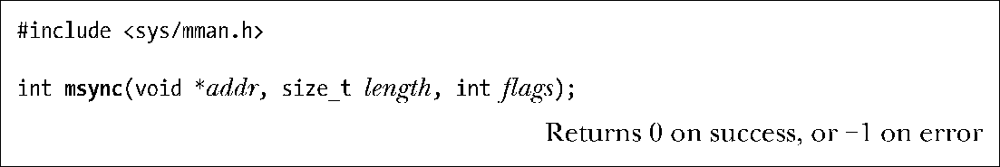

### 49.5　同步映射区域：msync()

内核会自动将发生在MAP_SHARED映射内容上的变更写入到底层文件中，但在默认情况下，内核不保证这种同步操作会在何时发生。（SUSv3要求一个实现提供这种保证。）

msync()系统调用让应用程序能够显式地控制何时完成共享映射与映射文件之间的同步。同步一个映射与底层文件在多种情况下都是非常有用的。如，为确保数据完整性，一个数据库应用程序可能会调用msync()强制将数据写入到磁盘上。调用msync()还允许一个应用程序确保在可写入映射上发生的更新会对在该文件上执行read()的其他进程可见。

传给msync()的addr和length参数指定了需同步的内存区域的起始地址和大小。在addr中指定的地址必须是分页对齐的，length会被向上舍入到系统分页大小的下一个整数倍。（SUSv3规定addr必须要分页对齐。SUSv4表示一个实现可以要求这个参数是分页对齐的。）

flags参数的可取值为下列值中的一个。

##### MS_SYNC

执行一个同步的文件写入。这个调用会阻塞直到内存区域中所有被修改过的分页被写入到底盘为止。

##### MS_ASYNC

执行一个异步的文件写入。内存区域中被修改过的分页会在后面某个时刻被写入磁盘并立即对在相应文件区域中执行read()的其他进程可见。

另一种区分这两个值的方式可以表述为在MS_SYNC操作之后，内存区域会与磁盘同步，而在MS_ASYNC操作之后，内存区域仅仅是与内核高速缓冲区同步。

> 如果在MS_ASYNC操作之后不采取进一步的动作，那么内存区域中被修改过的分页最终会作为由pdflush内核线程（在Linux 2.4以及之前的版本上是kupdated）执行的自动缓冲区刷新的一部分被写入到磁盘。在Linux上存在两种更快的发动输出的（非标准）方法。在msync()调用之后可以在映射对应的文件描述符上调用一个fsync()（或fdatasync()）。这个调用会阻塞直到快速缓冲区与磁盘同步为止。或者可以使用posix_fadvise() POSIX_FADV_DONTNEED操作启动一个异步的分页写入。（Linux特有的这两个操作并没有在SUSv3中予以规定。）

在flags参数中还可以加上下面这个值。

##### MS_INVALIDATE

使映射数据的缓存副本失效。当内存区域中所有被修改过的分页被同步到文件中之后，内存区域中所有与底层文件不一致的分页会被标记为无效。当下次引用这些分页时会从文件的相应位置处复制相应的分页内容，其结果是其他进程对文件做出的所有更新将会在内存区域中可见。

与很多其他现代UNIX实现一样，Linux提供了一个所谓的同一虚拟内存系统。这表示内存映射和高速缓冲区块会尽可能地共享同样的物理内存分页。因此通过映射获取的文件视图与通过I/O系统调用（read()、write()等）获得的文件视图总是一致的，而msync()的唯一用途就是强制将一个映射区域中的内容写入到磁盘。

不管怎样，SUSv3并没有要求实现统一虚拟内存系统，并且并不是所有的UNIX实现都提供了同一虚拟内存系统。在这类系统上需要调用msync()来使得一个映射上发生的变更对其他read()该文件的进程可见，并且在执行逆操作时需要使用MS_INVALIDATE标记来使得其他进程对文件所做出的写入对映射区域可见。使用mmap()和I/O系统调用操作同一个文件的多进程应用程序如果希望可被移植到不具备统一虚拟内存系统的系统之上的话就需要恰当使用msync()。

