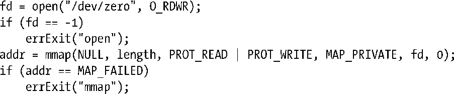
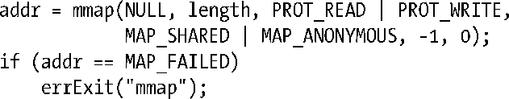
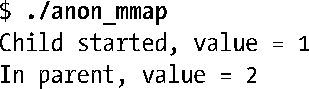
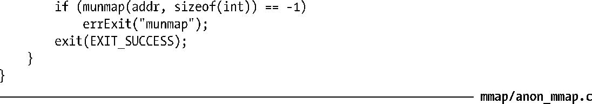

### 49.7　匿名映射

匿名映射是没有对应文件的一种映射。本节将介绍如何创建匿名映射以及私有和共享匿名映射的用途。

#### MAP_ANONYMOUS和/dev/zero

在Linux上，使用mmap()创建匿名映射存在两种不同但等价的方法。

+ 在flags中指定MAP_ANONYMOUS并将fd指定为−1。（在Linux上，当指定了MAP_ANONYMOUS之后会忽略fd的值。但一些UNIX实现要求在使用MAP_ANONYMOUS时将fd指定为−1，因此可移植的应用程序应该确保它们这样做了。）

> 要从<sys/mman.h>中获得MAP_ANONYMOUS的定义必须要定义_BSD_SOURCE特性测试宏或_SVID_SOURCE特性测试宏。Linux提供了常量MAP_ANON作为MAP_ANONYMOUS的一个同义词，其目的是为了与其他一些采用这种命名方式的UNIX实现保持兼容。

+ 打开/dev/zero设备文件并将得到的文件描述符传递给mmap()。

> /dev/zero是一个虚拟设备，当从中读取数据时它总是会返回0，而写入到这个设备中的数据总会被丢弃。/dev/zero的一个常见用途是使用0来组装一个文件（如使用dd(1)命令）。

不管是使用MAP_ANONYMOUS还是使用/dev/zero技术，得到的映射中的字节会被初始化为0。在两种技术中，offset参数都会被忽略（因为没有底层文件，所以也无从指定偏移量）。稍后将会介绍使用这两种技术的例子。

> MAP_ANONYMOUS和/dev/zero技术并没有在SUSv3进行规定，尽管大多数UNIX实现都支持其中一种或两种。之所以存在两种不同的技术实现同样的语义的原因是其中一种（MAP_ANONYMOUS）源自BSD，而另一种（/dev/zero）则源自System V。

#### MAP_PRIVATE匿名映射

MAP_PRIVATE匿名映射用来分配进程私有的内存块并将其中的内容初始化为0。下面的代码使用/dev/zero技术创建了一个MAP_PRIVATE匿名映射。

> glibc中的malloc()实现使用MAP_PRIVATE匿名映射来分配大小大于MMAP_THRESHOLD字节的内存块。这样在后面将这些内存块传递给free()之后就能高效地释放这些块（通过munmap()）。（它还降低了重复分配和释放大内存块而导致内存分片的可能性。）MMAP_THRESHOLD在默认情况下是128 kB，但可以通过mallopt()库函数来调整这个参数。

#### MAP_SHARED匿名映射

MAP_SHARED匿名映射允许相关进程（如父进程和子进程）共享一块内存区域而无需一个对应的映射文件。

> MAP_SHARED匿名映射只在Linux 2.4以及之后的版本上可用。

下面的代码使用MAP_ANONYMOUS技术创建了一个MAP_SHARED匿名映射。

如果在上面的代码之后加上一个对fork()的调用，那么由于通过fork()创建的子进程会继承映射，两个进程就会共享内存区域。

#### 示例程序

程序清单49-3演示了如何使用MAP_ANONYMOUS或/dev/zero技术来在父进程和子进程之间共享一个映射区域。至于到底该选择何种技术则由在编译程序时是否定义了USE_MAP_ANON来确定。父进程在调用fork()之前将共享区域中的一个整数初始化为1。然后子进程递增这个共享整数并退出，而父进程则等待子进程退出，然后打印出该整数的值。运行这个程序之后能看到下面这样的输出。

程序清单49-3：在父进程和子进程之间共享一个匿名映射

