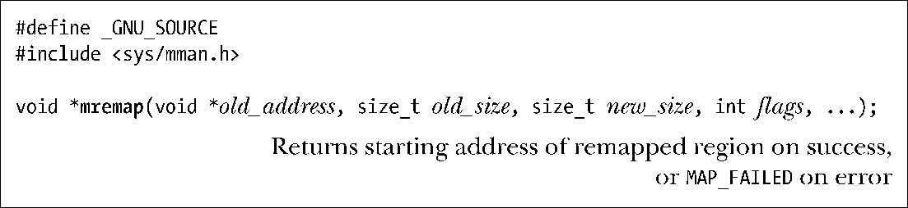

### 49.8　重新映射一个映射区域：mremap()

在大多数UNIX实现上一旦映射被创建，其位置和大小就无法改变了。但Linux提供了（不可移植的）mremap()系统调用来执行此类变更。

old_address和old_size参数指定了需扩展或收缩的既有映射的位置和大小。在old_address中指定的地址必须是分页对齐的，并且通常是一个由之前的mmap()调用返回的值。映射预期的新大小会通过new_size参数指定。在old_size和new_size中指定的值都会被向上舍入到系统分页大小的下一个整数倍。

在执行重映射的过程中内核可能会为映射在进程的虚拟地址空间中重新指定一个位置，而是否允许这种行为则是由flags参数来控制的。它是一个位掩码，其值要么是0，要么包含下列几个值。

##### MREMAP_MAYMOVE

如果指定了这个标记，那么根据空间要求的指令，内核可能会为映射在进程的虚拟地址空间中重新指定一个位置。如果没有指定这个标记，并且在当前位置处没有足够的空间来扩展这个映射，那么就返回ENOMEM错误。

##### MREMAP_FIXED（自Linux 2.4起）

这个标记只能与MREMAP_MAYMOVE一起使用。它在mremap()中所起的作用与MAP_FIXED在mmap()（49.10节）中所起的作用类似。如果指定了这个标记，那么mremap()会接收一个额外的参数void *new_address，该参数指定了一个分页对齐的地址，并且映射将会被迁移至该地址处。所有之前在由new_address和new_size确定的地址范围之内的映射将会被解除映射。

mremap()在成功时会返回映射的起始地址。由于（如果指定了MREMAP_MAYMOVE标记）这个地址可能与之前的起始地址不同，从而导致指向这个区域中的指针可能会变得无效，因此使用mremap()的应用程序在引用映射区域中的地址时应该只使用偏移量（不是绝对指针）（参见48.6节）。

> 在Linux上，realloc()函数使用mremap()来高效地为malloc()之前使用mmap() MAP_ANONYMOUS分配的大内存块重新指定位置。（在49.7节中介绍glibc malloc()实现的时候曾提及过这个特性。）使用mremap()来完成这种任务使得在重新分配空间的过程中避免复制字节成为可能。

