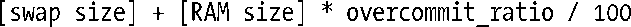

### 49.9　MAP_NORESERVE和过度利用交换空间

一些应用程序会创建大（通常是私有匿名的）映射，但只使用映射区域中的一小部分。如特定的科学应用程序会分配非常大的数组，但只使用其中一些散落在数组各处的元素（所谓的稀疏数组）。

如果内核总是为此类映射分配（或预留）足够的交换空间，那么很多交换空间可能会被浪费。相反，内核可以只在需要用到映射分页的时候（即当应用程序访问分页时）为它们预留交换空间。这种方法被称为懒交换预留（lazy swap reservation），它的一个优点是应用程序总共使用的虚拟内存量能够超过RAM加上交换空间的总量。

换个角度来看，懒交换预留允许交换空间被过度利用。这种方式能够很好地工作，只要所有进程都不试图访问整个映射。但如果所有应用程序都试图访问整个映射，那么RAM和交换空间就被耗尽。在这种情况下，内核会通过杀死系统中的一个或多个进程来降低内存压力。在理想情况下，内核会尝试选择引起内存问题的进程（参见下面对OOM杀手的讨论），但这是无法保证的。正因为这个原因，有时候可能会选择防止懒交换预留，转而强制系统在映射被创建时分配所有所需的交换空间。

内核如何处理交换空间的预留是由调用mmap()时是否使用了MAP_NORESERVE标记以及影响系统层面的交换空间过度利用操作的/proc接口来控制的。表49-4对这些因素进行了总结。

<b class="my_markdown">表49-4：在mmap()中处理交换空间预留</b>

| overcommit _ memory值 | 是否在mmap()调用指定了MAP_NORESERVE |
| :-----  | :-----  | :-----  | :-----  |
| 否 | 是 |
| 0 | 拒绝明显的过度利用 | 允许过度利用 |
| 1 | 允许过度利用 | 允许过度利用 |
| 2（自Linux 2.6起） | 严格的过度利用 |

Linux特有的/proc/sys/vm/overcommit_memory文件包含了一个整数值，它控制着内核对交换空间过度利用的处理。在2.6之前的Linux上这个文件中的整数只能取两个值：0表示拒绝明显的过度利用（遵从MAP_NORESERVE标记的使用），大于0表示在所有情况下都允许过度利用。

拒绝过度利用意味着大小不超过当前可用空闲内存的映射是被允许的。既有的分配可能会被过度利用（因为它们可能不会使用映射的所有分页）。

从Linux 2.6起，1的含义与之前的内核中正数的含义一样，但2（或更大）则会导致使用采用严格的过度利用。在这种情况下，内核会在所有mmap()分配上执行严格的记账并将系统中此类分配的总量控制在小于或等于：

overcommit_ratio的值是一个整数——用百分比表示——它位于Linux特有的/proc/sys/vm/ overcommit_ratio文件中。这个文件中包含的默认值是50，表示内核最多可分配的空间为系统RAM总量的50%，只要所有进程不同时试图全部用完给它们分配的内存，那么这种空间的分配就不会有问题。

注意过度利用监控只适用于下面这些映射。

+ 私有可写映射（包括文件和匿名映射），这种映射的交换“开销”等于所有使用该映射的进程为该映射所分配的空间总和。
+ 共享匿名映射，这种映射的交换“开销”等于映射的大小（因为所有进程共享该映射）。

为只读私有映射预留交换空间是没有必要的，因为映射中的内容是不可变更的，从而无需使用交换空间。共享文件映射也不需要使用交换空间，因为映射文件本身担当了映射的交换空间。

当一个子进程在fork()调用中继承了一个映射时，它将会继承该映射的MAP_NORESERVE设置。MAP_NORESERVE标记并没有在SUSv3中予以规定，它只在其他一些UNIX实现上得到了支持。

> 本节讨论了mmap()调用在增长一个进程的地址空间时是如何因系统在RAM和交换空间上的限制而可能发生失败的。mmap()调用还可能因为碰到了进程级别的RLIMIT_AS资源限制（在36.3节中予以了介绍）而发生失败，该限制给调用进程的地址空间大小规定了一个上限。

#### OOM杀手

上面提及过当使用懒交换预留时，如果应用程序试图使用整个映射的话就会导致内存被耗尽。在这种情况下，内核会通过杀死进程来缓解内存消耗情况。

内核中用来在内存被耗尽时选择杀死哪个进程的代码通常被称为out-of-memory（OOM）杀手。OOM杀手会尝试选择杀死能够缓解内存消耗情况的最佳进程，这里的“最佳”是由一组因素来确定的。如一个进程消耗的内存越多，它就越可能成为OOM杀手的候选目标。其他能提高一个进程被选中的可能性的因素包括进程是否创建了很多子进程以及进程是否拥有一个较低的nice值（即大于0的值）。内核一般不会杀死下列进程。

+ 特权进程，因为它们可能正在执行重要的任务。
+ 正在访问裸设备的进程，因为杀死它们可能会导致设备处理一个不可用的状态。
+ 已经运行了很长时间或已经消耗了大量CPU的进程，因为杀死它们可能会导致丢失很多“工作”。

为杀死被选中的进程，OOM杀手会向其发送一个SIGKILL信号。

从2.6.11内核开始，Linux特有的/proc/PID/oom_score文件给出了在需要调用OOM杀手时内核赋给每个进程的权重。在这个文件中，进程的权重越大，那么在必要的时候被OOM杀手选中的可能性就越大。同样也是从2.6.11内核开始，Linux特有的/proc/PID/oom_adj文件能够用来影响一个进程的oom_score值。这个文件可以被设置成范围在−16到+15之间的任意一个值，其中负数会减小oom_score值，而正数则会增大oom_score值。特殊值−17会完全将进程从OOM杀手的候选目标中删除。有关这一方面的更多细节请参考proc(5)手册。

