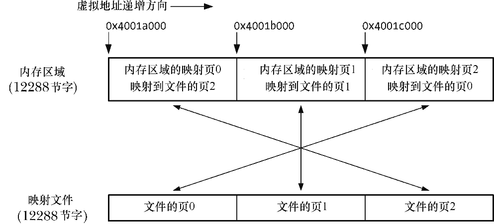
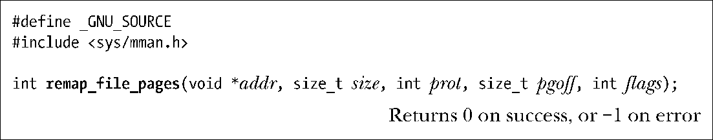
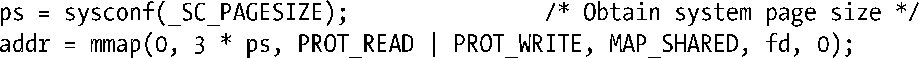
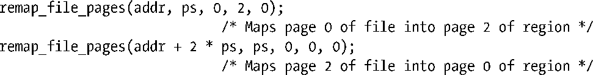

### 49.11　非线性映射：remap_file_pages()

使用mmap()创建的文件映射是连续的：映射文件的分页与内存区域的分页存在一个顺序的、一对一的对应关系。对于大多数应用程序来讲，线性映射已经够用了。然而一些应用程序需要创建大量的非线性映射——文件分页的顺序与它们在连续内存中出现的顺序不同的映射。图49-5给出了一种非线性映射。

<b class="my_markdown">图49-5：一个非线性文件映射</b>

在上一节中介绍了一种创建非线性映射的方法：使用多个带MAP_FIXED标记的mmap()调用。然而这种方法的伸缩性不够好，其问题在于其中每个mmap()调用都会创建一个独立的内核虚拟内存区域（VMA）数据结构。每个VMA的配置需要花费时间并且会消耗一些不可交换的内核内存。此外，大量的VMA会降低虚拟内存管理器的性能。特别地，当存在数以万计的VMA时处理每个分页故障所花费的时间会大幅度提高。（这对于一些在一个数据库文件中维护多个不同视图的大型数据库管理系统来讲是一个问题。）

> /proc/PID/maps文件（参见48.5节）中一行表示一个VMA。

从内核2.6开始，Linux提供了remap_file_pages()系统调用来在无需创建多个VMA的情况下创建非线性映射，具体如下。

**1．** 使用mmap()创建一个映射。

**2．** 使用一个或多个remap_file_pages()调用来调整内存分页和文件分页之间的对应关系。（remap_file_pages()所做的工作是操作进程的页表。）

pgoff和size参数标识了一个在内存中的位置待改变的文件区域，pgoff参数指定了文件区域的起始位置，其单位是系统分页代销（sysconf(_SC_PAGESIZE)的返回值）。size参数指定了文件区域的长度，其单位为字节。addr参数起两个作用。

+ 它标识了分页需调整的既有映射。换句话说，addr必须是一个位于之前通过mmap()映射的区域中的地址。
+ 它指定了通过pgoff和size标识出的文件分页所处的内存地址。

addr和size都应该是系统分页大小的整数倍。如果不是，那么它们会被向下舍入到最近的分页大小的整数倍。

假设使用了下面的mmap()调用来映射通过描述符fd引用的打开着的文件的三个分页，并且该调用将返回地址0x4001a000赋给了addr。

下面的调用将会创建一个非线性映射，如图49-5所示。

到现在为止还没有对remap_file_pages()中的其他两个参数进行介绍。

+ prot参数会被忽略，其值必须是0。在将来可能能够使用这个参数来修改受remap_file_pages()影响的内存区域的保护信息。在当前实现中，保护信息保持与整个VMA上的保护信息一致。

> 虚拟机和垃圾收集器是其他一些使用多个VMA的应用程序，其中一些应用程序需要能够写保护单个分页。因此人们预期remap_file_pages()将会还允许修改一个VMA中单个分页上的权限，但到目前为止这种特性还没有被实现。

+ flags参数当前未被使用。

在当前的实现上，remap_file_pages()仅适用于共享（MAP_SHARED）映射。

remap_file_pages()系统调用是Linux特有的，SUSv3并没有对这个函数进行规定，并且其他UNIX实现也没有提供这个函数。

