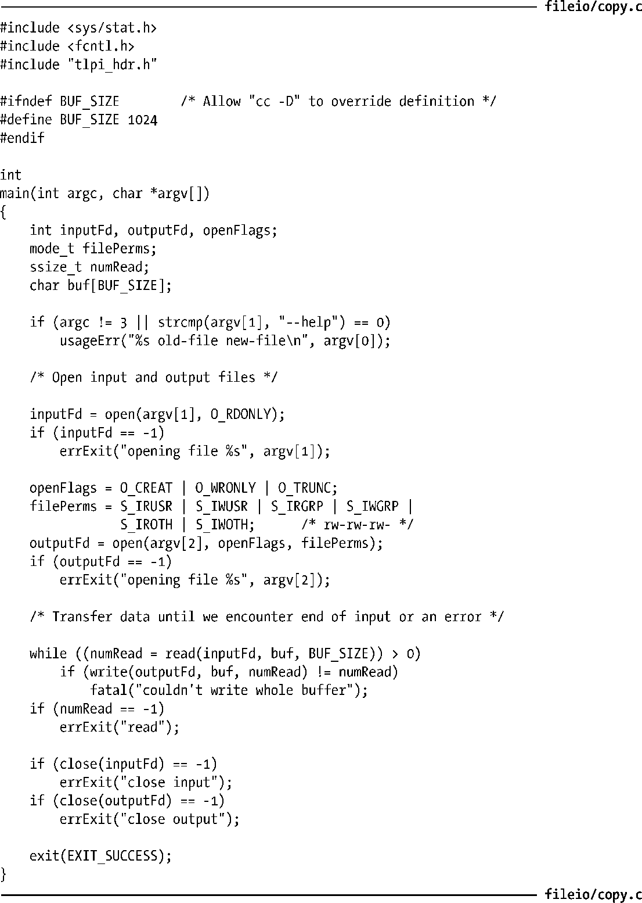

### 4.1　概述

所有执行I/O操作的系统调用都以文件描述符，一个非负整数（通常是小整数），来指代打开的文件。文件描述符用以表示所有类型的已打开文件，包括管道（pipe）、FIFO、socket、终端、设备和普通文件。针对每个进程，文件描述符都自成一套。

按照惯例，大多数程序都期望能够使用3种标准的文件描述符，见表4-1。在程序开始运行之前，shell代表程序打开这3个文件描述符。更确切地说，程序继承了shell文件描述符的副本——在shell的日常操作中，这3个文件描述符始终是打开的。（在交互式shell中，这3个文件描述符通常指向shell运行所在的终端。）如果命令行指定对输入/输出进行重定向操作，那么shell会对文件描述符做适当修改，然后再启动程序。

<b class="my_markdown">表4-1：标准文件描述符</b>

| 文件描述符 | 用　　途 | POSIX名称 | stdio流 |
| :-----  | :-----  | :-----  | :-----  | :-----  | :-----  |
| 0 | 1 | 2 | 标准输入 | 标准输出 | 标准错误 | STDIN_FILENO | STDOUT_FILENO | STDERR_FILENO | stdin | stdout | stderr |

在程序中指代这些文件描述符时，可以使用数字（0、1、2）表示，或者采用<unistd.h>所定义的POSIX标准名称——此方法更为可取。

> 虽然stdin、stdout和stderr变量在程序初始化时用于指代进程的标准输入、标准输出和标准错误，但是调用freopen()库函数可以使这些变量指代其他任何文件对象。作为其操作的一部分，freopen()可以在将流（stream）重新打开之际一并更换隐匿其中的文件描述符。换言之，针对stdout调用freopen()函数后，无法保证stdout变量值仍然为1。

下面介绍执行文件I/O操作的4个主要系统调用（编程语言和软件包通常会利用I/O函数库对它们进行间接调用）。

+ fd = open(pathname, flags, mode) 函数打开pathname所标识的文件，并返回文件描述符，用以在后续函数调用中指代打开的文件。如果文件不存在，open()函数可以创建之，这取决于对位掩码参数flags的设置。flags参数还可指定文件的打开方式：只读、只写亦或是读写方式。mode参数则指定了由open()调用创建文件的访问权限，如果open()函数并未创建文件，那么可以忽略或省略mode参数。
+ numread = read(fd, buffer, count) 调用从fd所指代的打开文件中读取至多count字节的数据，并存储到buffer中。read()调用的返回值为实际读取到的字节数。如果再无字节可读（例如：读到文件结尾符EOF时），则返回值为0。
+ numwritten = write(fd, buffer, count) 调用从buffer中读取多达count字节的数据写入由fd所指代的已打开文件中。write()调用的返回值为实际写入文件中的字节数，且有可能小于count。
+ status = close(fd)在所有输入/输出操作完成后，调用close()，释放文件描述符fd以及与之相关的内核资源。

在详细说明这些系统调用之前，程序清单4-1简要展示了它们的使用方法。该程序实现了一个简版的cp(1)命令，将源文件内容复制到新文件中。在命令行中，程序的第一个参数代表已存在的源文件，第二个参数则代表新文件。程序清单4-1如下所示：

程序清单4-1：使用I/O系统调用

