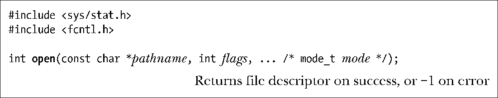
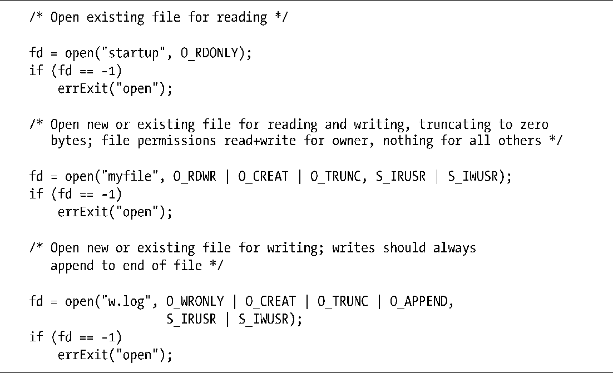
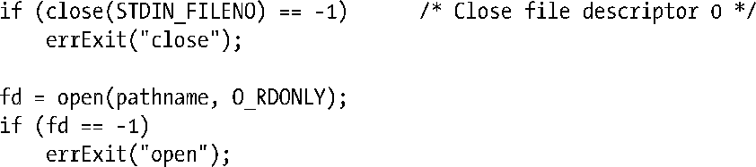

### 4.3　打开一个文件：open()

open()调用既能打开一个业已存在的文件，也能创建并打开一个新文件。

要打开的文件由参数pathname来标识。如果pathname是一符号链接，会对其进行解引用。如果调用成功，open()将返回一文件描述符，用于在后续函数调用中指代该文件。若发生错误，则返回−1，并将errno置为相应的错误标志。

参数flags为位掩码，用于指定文件的访问模式，可选择表4-2所示的常量之一。

> 早期的UNIX实现中使用数字0、1、2，而非表4-2中所列的常量名称。大多数现代UNIX实现将这些常量定义为上述相应数字（以期与早期系统保持兼容）。由此可见，O_RDWR并不等同于O_RDONLY | O_WRONLY，后者（或组合）属于逻辑错误。

当调用open()创建新文件时，位掩码参数mode指定了文件的访问权限。（SUSv3规定，mode的数据类型mode_t属于整数类型。）如果open()并未指定O_CREAT标志，则可以省略mode参数。

<b class="my_markdown">表4-2：文件访问模式</b>

| 访 问 模 式 | 描　　述 |
| :-----  | :-----  | :-----  | :-----  |
| O_RDONLY | 以只读方式打开文件 |
| O_WRONLY | 以只写方式打开文件 |
| O_RDWR | 以读写方式打开文件 |

15.4 节将详细描述文件权限。之后，读者会了解到新建文件的访问权限不仅仅依赖于参数mode，而且受到进程的umask值（15.4.6节）和（可能存在的）父目录的默认访问控制列表（17.6节）影响。与此同时，需要注意mode参数可以指定为数字（通常为八进制数），更为可取的做法是对0个或多个表15-4（15.4.1节）中所列位掩码常量进行逻辑或（|）操作。

程序清单4-2展示了open()调用的几个使用实例，其中有些调用用到了其他标志位，后续将会加以介绍。

程序清单4-2：open函数使用的例子

#### open()调用所返回的文件描述符数值

SUSv3 规定，如果调用 open()成功，必须保证其返回值为进程未用文件描述符中数值最小者。可以利用该特性以特定文件描述符打开某一文件。例如，如下代码序列就会确保使用标准输入（文件描述符0）打开一文件。

由于文件描述符0未用，所以open()调用势必使用此描述符打开文件。5.5节中所论及的dup2()和fcntl()也可实现类似功能，但对于文件描述符的控制更加灵活。该节还将举例说明对于业已打开的文件，控制其描述符为何大有益处。

