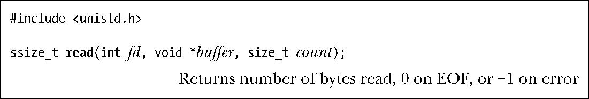
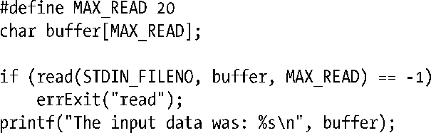
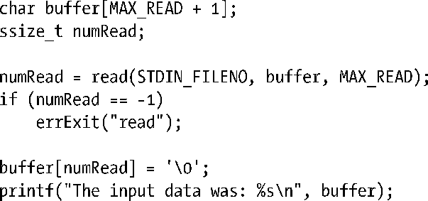

### 4.4　读取文件内容：read()

read()系统调用从文件描述符fd所指代的打开文件中读取数据。

count参数指定最多能读取的字节数。（size_t数据类型属于无符号整数类型。）buffer参数提供用来存放输入数据的内存缓冲区地址。缓冲区至少应有count个字节。

> 系统调用不会分配内存缓冲区用以返回信息给调用者。所以，必须预先分配大小合适的缓冲区并将缓冲区指针传递给系统调用。与此相反，有些库函数却会分配内存缓冲区用以返回信息给调用者。

如果read()调用成功，将返回实际读取的字节数，如果遇到文件结束（EOF）则返回0，如果出现错误则返回-1。ssize_t数据类型属于有符号的整数类型，用来存放（读取的）字节数或-1（表示错误）。

一次read()调用所读取的字节数可以小于请求的字节数。对于普通文件而言，这有可能是因为当前读取位置靠近文件尾部。

当read()应用于其他文件类型时，比如管道、FIFO、socket或者终端，在不同环境下也会出现read()调用读取的字节数小于请求字节数的情况。例如，默认情况下从终端读取字符，一遇到换行符（\n），read()调用就会结束。在后续章节论及其他类型文件时，会再次针对这些情况进行探讨。

使用read()从终端读取一连串字符，我们也许期望下面的代码会起作用：

这段代码的输出可能会很奇怪，因为输出结果除了实际输入的字符串外还会包括其他字符。这是因为read()调用没有在printf()函数打印的字符串尾部添加一个表示终止的空字符。思索片刻就会意识到这肯定是症结所在，因为read()能够从文件中读取任意序列的字节。有些情况下，输入信息可能是文本数据，但在其他情况下，又可能是二进制整数或者二进制形式的C语言数据结构。read()无从区分这些数据，故而也无法遵从C语言对字符串处理的约定，在字符串尾部追加标识字符串结束的空字符。如果输入缓冲区的结尾处需要一个表示终止的空字符，必须显式追加。

由于表示字符串终止的空字符需要一个字节的内存，所以缓冲区的大小至少要比预计读取的最大字符串长度多出1个字节。

