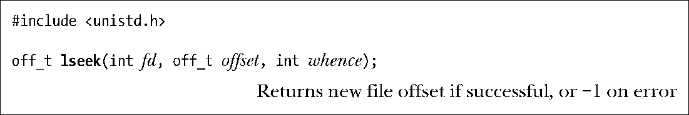
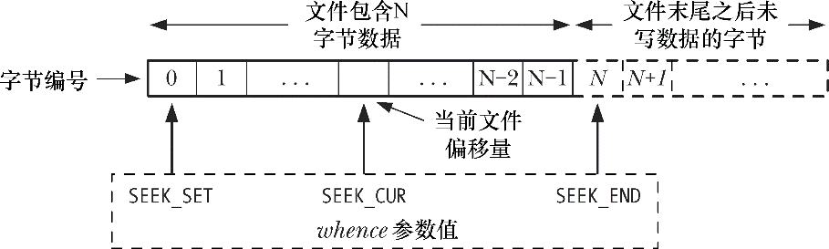
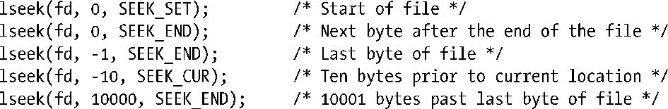
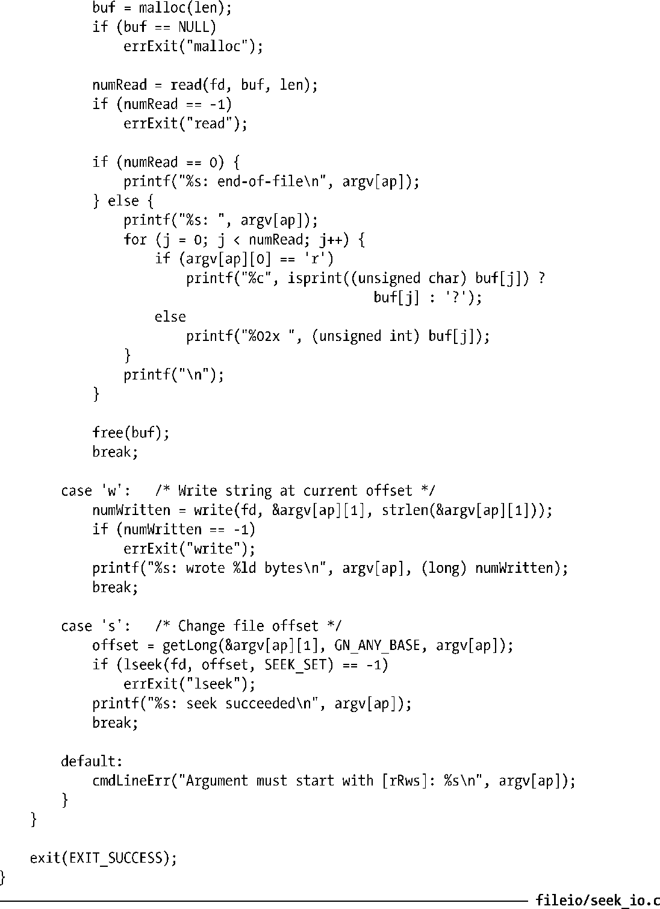
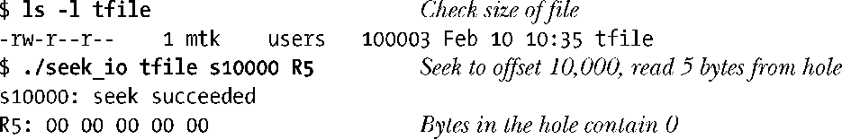

### 4.7　改变文件偏移量：lseek()

对于每个打开的文件，系统内核会记录其文件偏移量，有时也将文件偏移量称为读写偏移量或指针。文件偏移量是指执行下一个read()或write()操作的文件起始位置，会以相对于文件头部起始点的文件当前位置来表示。文件第一个字节的偏移量为0。

文件打开时，会将文件偏移量设置为指向文件开始，以后每次read()或write()调用将自动对其进行调整，以指向已读或已写数据后的下一字节。因此，连续的read()和write()调用将按顺序递进，对文件进行操作。

针对文件描述符fd参数所指代的已打开文件，lseek()系统调用依照offset和whence参数值调整该文件的偏移量。

offset参数指定了一个以字节为单位的数值。（SUSv3规定off_t数据类型为有符号整型数。）whence参数则表明应参照哪个基点来解释offset参数，应为下列其中之一：

##### SEEK_SET

将文件偏移量设置为从文件头部起始点开始的offset个字节。

##### SEEK_CUR

相对于当前文件偏移量，将文件偏移量调整offset个字节②。

##### SEEK_END

将文件偏移量设置为起始于文件尾部的offset个字节。也就是说，offset参数应该从文件最后一个字节之后的下一个字节算起。

图4-1展示了whence参数的含义。

<b class="my_markdown">图4-1：解释lseek()函数中whence参数</b>

在早期的UNIX实现中，whence参数用整数0、1、2来表示，而非正文中显示的SEEK_*常量。BSD的早期版本使用另一套命名：L_SET、L_INCR和L_XTND来表示whence参数。

如果whence参数值为SEEK_CUR或SEEK_END，offset参数可以为正数也可以为负数；如果whence参数值为SEEK_SET，offset参数值必须为非负数。

lseek()调用成功会返回新的文件偏移量。下面的调用只是获取文件偏移量的当前位置，并没有修改它。

> 有些UNIX系统（Linux不在此列）实现了非标准的tell(fd)函数，其调用目的与上述lseek()相同。

这里给出了lseek()调用的其他一些例子，在注释中说明了将文件偏移量移到的具体位置。

lseek()调用只是调整内核中与文件描述符相关的文件偏移量记录，并没有引起对任何物理设备的访问。

5.4节将进一步描述文件偏移量、文件描述符、已打开文件三者之间的关系。

lseek()并不适用于所有类型的文件。不允许将lseek()应用于管道、FIFO、socket或者终端。一旦如此，调用将会失败，并将errno置为ESPIPE。另一方面，只要合情合理，也可以将lseek()应用于设备。例如，在磁盘或者磁带上查找一处具体位置。

> lseek()调用名中的l源于这样一个事实：offset参数和调用返回值的类型起初都是long型。早期的UNIX系统还提供了seek()系统调用，当时这两个值的类型为int型。

#### 文件空洞

如果程序的文件偏移量已然跨越了文件结尾，然后再执行I/O操作，将会发生什么情况？read()调用将返回0，表示文件结尾。有点令人惊讶的是，write()函数可以在文件结尾后的任意位置写入数据。

从文件结尾后到新写入数据间的这段空间被称为文件空洞。从编程角度看，文件空洞中是存在字节的，读取空洞将返回以0（空字节）填充的缓冲区。

然而，文件空洞不占用任何磁盘空间。直到后续某个时点，在文件空洞中写入了数据，文件系统才会为之分配磁盘块。文件空洞的主要优势在于，与为实际需要的空字节分配磁盘块相比，稀疏填充的文件会占用较少的磁盘空间。核心转储文件（core dump）（见22.1节）是包含空洞文件的常见例子。

> 对于文件空洞不占用磁盘空间的说法需要稍微限定一下。在大多数文件系统中，文件空间的分配是以块为单位的（14.3节）。块的大小取决于文件系统，通常是1024字节、2048字节、4096字节。如果空洞的边界落在块内，而非恰好落在块边界上，则会分配一个完整的块来存储数据，块中与空洞相关的部分则以空字节填充。

大多数“原生”UNIX文件系统都支持文件空洞的概念，但很多“非原生”文件系统（比如，微软的VFAT）并不支持这一概念。不支持文件空洞的文件系统会显式地将空字节写入文件。

空洞的存在意味着一个文件名义上的大小可能要比其占用的磁盘存储总量要大（有时会大出许多）。向文件空洞中写入字节，内核需要为其分配存储单元，即使文件大小不变，系统的可用磁盘空间也将减少。这种情况并不常见，但也需要了解。

> SUSv3的函数posix_fallocate(fd, offset, len)规定，针对文件描述符fd所指代的文件，能确保按照由offset参数和len参数所确定的字节范围为其在磁盘上分配存储空间。这样，应用程序对文件的后续write()调用不会因磁盘空间耗尽而失败（否则，当文件中一个空洞被填满后，或者因其他应用程序消耗了磁盘空间时，都可能因磁盘空间耗尽而引发此类错误）。在过去，glibc库在实现posix_fallocate()函数时，通过向指定范围内的每个块写入一个值为0的字节以达到预期结果。自内核版本2.6.23开始，Linux系统提供了fallocate()系统调用，能更为高效地确保所需存储空间的分配。当fallocate()调用可用时，glibc库会利用其来实现posix_fallocate()函数的功能。

14.4节将描述空洞在文件中的表示方式。15.1节将描述stat()系统调用，该调用能够提供文件当前大小和实际分配给文件的块数量等信息。

#### 示例程序

程序清单4-3演示了lseek()与read()、write()的协作使用。该程序的第一个命令行参数为将要打开的文件名称，余下的参数则指定了在文件上执行的输入/输出操作。每个表示操作的参数都以一个字母开头，紧跟以相关值（中间无空格分隔）。

+ soffset：从文件开始检索到offset字节位置。
+ rlength：在当前文件偏移量处，从文件中读取length字节数据，并以文本形式显示。
+ Rlength：在当前文件偏移量处，从文件中读取length字节数据，并以十六进制形式显示。
+ wstr：在当前文件偏移量处，向文件写入由str指定的字符串。

程序清单4-3：read()、write()和lseek()的使用示范

下面的shell会话演示了程序清单4-3程序的使用，还显示了从文件空洞中读取字节时的情况：

