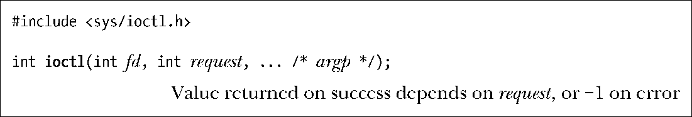

### 4.8　通用I/O模型以外的操作：ioctl()

在本章上述通用I/O模型之外，ioctl()系统调用又为执行文件和设备操作提供了一种多用途机制。

fd参数为某个设备或文件已打开的文件描述符，request参数指定了将在fd上执行的控制操作。具体设备的头文件定义了可传递给request参数的常量。

ioctl()调用的第三个参数采用了标准C语言的省略符号（...）来表示（称之为argp），可以是任意数据类型。ioctl()根据request的参数值来确定argp所期望的类型。通常情况下，argp是指向整数或结构的指针，有些情况下，不需要使用argp。

后面各章中将会有许多ioctl()的用法展示（例如15.5节）。

> SUSv3为ioctl()制定的唯一规定是针对流（STREAM）设备的控制操作。（流是System V操作系统中的特性。尽管为其开发有一些插件，主流的Linux内核并不支持该特性。）本书述及的ioctl()的其他操作都不在SUSv3的规范之列。然而，从早期版本开始，ioctl()调用就是UNIX系统的一部分，因此本书所描述的几个ioctl()操作在许多其他UNIX系统中都已实现。在讨论ioctl()调用的各个操作时，会点出存在的可移植性问题。

