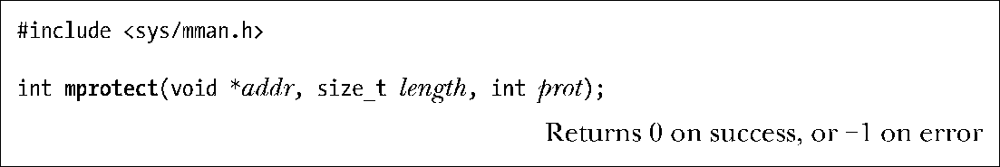
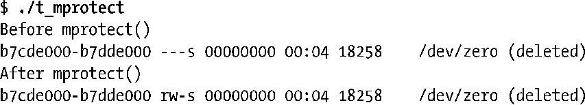

### 50.1　改变内存保护：mprotect()

mprotect()系统调用修改起始位置为addr长度为length字节的虚拟内存区域中分页上的保护。

addr的取值必须是系统分页大小（sysconf(_SC_PAGESIZE)的返回值）的整数倍。（SUSv3规定addr必须是分页对齐的。SUSv4表示一个实现可以要求这个参数是分页对齐的。）由于保护是设置在整个分页上的，因此实际上length会被向上舍入到系统分页大小的下一个整数倍。

prot参数是一个位掩码，它指定了这块内存区域上的新保护，其取值是PROT_NONE或PROT_READ、PROT_WRITE、以及PROT_EXEC这三个值中的一个或多个取OR。所有这些值的含义与它们在mmap()中的含义是一样的（表49-2）。

如果一个进程在访问一块内存区域时违背了内存保护，那么内核就会向该进程发送一个SIGSEGV信号。

mprotect()的一个用途是修改原先通过mmap()调用设置的映射内存区域上的保护，如程序清单50-1所示。这个程序创建了一个最初拒绝所有访问（PROT_NONE）的匿名映射，然后将该区域上的保护修改为读加写。在做出变更之前和之后，程序使用system()函数执行了一个shell命令来打印出与该映射区域对应的/proc/PID/maps文件中的内容，这样就能够看到内存保护上发生的变更了。（其实通过直接解析/proc/self/maps就能获取映射信息，这里之所以使用system()调用是因为这种做法所需的编码量更少。）运行这个程序之后可以看到下面的输出。

从上面输出的最后一行可以看出mprotect()已经将内存区域上的权限修改为PROT_READ | PROT_WRITE。（至于在shell输出中为何在/dev/zero后面出现了(deleted)字符串的原因请参考48.5节。）

程序清单50-1：使用mprotect()修改内存保护

