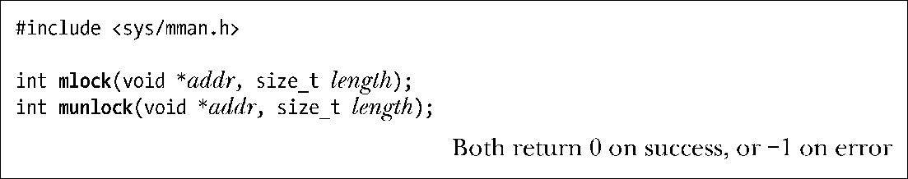
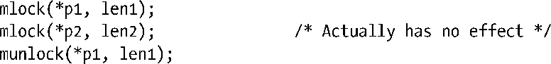
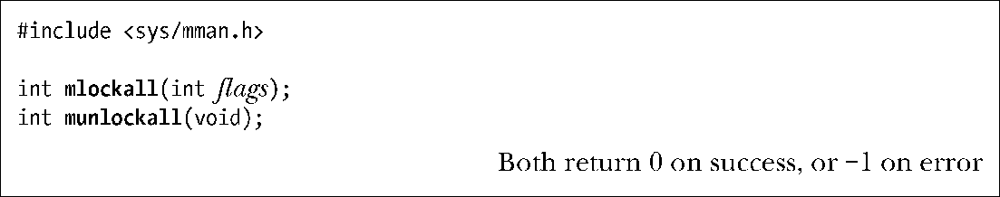

### 50.2　内存锁：mlock()和mlockatt()

在一些应用程序中将一个进程的虚拟内存的部分或全部锁进内存以确保它们总是位于物理内存中是非常有用的。之所以需要这样做的一个原因是它可以提高性能。对被锁住的分页的访问可以确保永远不会因为分页故障而发生延迟。这对于那些需要确保快速响应时间的应用程序来讲是很有用的。

给内存加锁的另一个原因是安全。如果一个包含敏感数据的虚拟内存分页永远不会被交换出去，那么该分页的副本就不会被写入到磁盘。如果该分页被写入到了磁盘，那么从理论上来讲就可以在后面某个时刻直接从磁盘中读取该分页。（攻击者可能会故意通过运行一个消耗大量内存的程序来构造这种场景，从而强制其他进程占据的内存被交换到磁盘上。）由于内核不保证会清除交换空间中保存的数据，因此即使在进程终止之后也可能从交换空间中读取信息。（一般来讲，只有特权进程才能够从交换设备上读取数据。）

> 膝上型计算机以及一些桌面系统上的挂起模式将系统的RAM副本保存到磁盘上，不管是否存在内存锁。

本节将介绍用于给一个进程的虚拟内存的部分或全部进行加锁和解锁的系统调用。下面在开始介绍这些系统调用之前首先看一下管理内存加锁的资源限制。

#### RLIMIT_MEMLOCK资源限制

在36.3节中对RLIMIT_MEMLOCK限制进行了简要的介绍，它为一个进程能够锁进内存的字节数设定了一个上限。下面开始对这个限制进行详细介绍。

在2.6.9之前的Linux内核中，只有特权进程（CAP_IPC_LOCK）才能给内存加锁，RLIMIT_MEMLOCK软资源限制为一个特权进程能够锁住的字节数设定一个上限。

从Linux 2.6.9开始，内存加锁模型发生了变化，即允许非特权进程给一小段内存进行加锁。这对于那些需要将一小部分敏感信息锁进内存以确保这些信息永远不会被写入到磁盘上的交换空间的应用程序来讲是非常有用的，如gpg是通过密码短语来完成这件事情的。这种模型上的变更会导致：

+ 特权进程能够锁住的内存数量是没有限制的（即RLIMIT_MEMLOCK会被忽略）；
+ 非特权进程能够锁住的内存数量上限由软限制RLIMIT_MEMLOCK定义。

软和硬RLIMIT_MEMLOCK限制的默认值都是8个分页（即在x86-32上是32768字节）。

RLIMIT_MEMLOCK限制影响：

+ mlock()和mlockall()；
+ mmap() MAP_LOCKED标记，该标记用来在映射被创建时将内存映射锁进内存，具体可参见49.6节中的描述；
+ shmctl() SHM_LOCK操作，该操作用来给System V共享内存段加锁，具体可参见48.7节中的描述。

由于虚拟内存的管理单位是分页，因此内存加锁会应用于整个分页。在执行限制检查时，RLIMIT_MEMLOCK限制会被向下舍入到最近的系统分页大小的整数倍。

尽管这个资源限制只有一个（软）值，但实际上它定义了两个单独的限制：

+ 对于mlock()、mlockall()以及mmap() MAP_LOCKED操作来讲，RLIMIT_MEMLOCK定义了一个进程级别的限制，它限制了一个进程的虚拟地址空间中能够被锁进内存的字节数。
+ 对于shmctl() SHM_LOCK操作来讲，RLIMIT_MEMLOCK定义了一个用户级别的限制，它限制了这个进程的真实用户ID在共享内存段中能够锁住的字节数。当一个进程执行了一个shmctl() SHM_LOCK操作时，内核会检查被调用进程的真实用户ID锁住的System V共享内存的总字节数。如果待加锁的段的大小不会导致总量违背进程的RLIMIT_MEMLOCK限制，那么操作就会成功。

RLIMIT_MEMLOCK在System V共享内存上之所以存在不同语义是因为共享内存段即使在没有被附加到任何一个进程之上时也是能够继续存在的。（共享内存段只有在显式的shmctl() IPC_RMID操作之后并且所有进程都在它们的地址空间中与之分离之后才会被删除。）

#### 给内存区域加锁和解锁

一个进程可以使用mlock()和munlock()来给一块内存区域加锁和解锁。

mlock()系统调用会锁住调用进程的虚拟地址空间中起始地址为addr长度为length字节的区域中的所有分页。与传入其他一些与内存相关的系统调用中的相应参数相比，这里的addr无需是分页对齐的：内核会从addr下面的下一个分页边界开始锁住分页。然而，SUSv3允许一个实现要求addr为系统分页大小的整数倍，可移植的应用程序在调用mlock()和munlock()应该确保这一点。

由于加锁操作的单位是分页，因此被锁住的区域的结束位置为大于length加addr的下一个分页边界。例如，在一个分页大小为4096字节的系统上，mlock(2000, 4000)调用会将0到8191之间的字节锁住。

> 通过查看Linux特有的/proc/PID/status文件中的VmLck条目能够找出一个进程当前已经锁住的内存数量。

在mlock()调用成功之后就能确保指定区域中的分页会被锁住并驻留在物理内存中。当没有足够的物理内存来锁住所有所请求的分页或请求违背RLIMIT_MEMLOCK软资源限制时mlock()系统调用就会失败。

程序清单50-2给出了一个使用mlock()的例子。

munlock()系统调用执行的操作与mlock()相反，即删除之前由调用进程创建的内存锁。addr和length参数被解释的方式与它们在munlock()中被解释的方式是相同的。给一组分页解锁并不能确保它们就不会驻留在内存中了：只有在其他进程请求内存的时候才会从RAM中删除分页。

除了显式地使用munlock()之外，内存锁在下列情况下会被自动删除。

+ 在进程终止时。
+ 当被锁住的分页通过munmap()被解除映射时。
+ 当被锁住的分页被使用mmap() MAP_FIXED标记的映射覆盖时。

#### 内存加锁语义的细节信息

在下面的几个段落中将会介绍内存锁语义的一些细节。

内存锁不会被通过fork()创建的子进程继承，也不会在exec()执行期间被保留。

当多个进程共享一组分页时（如MAP_SHARED映射），只要还存在一个进程持有着这些分页上的内存锁，那么这些分页就会保持被锁进内存的状态。

内存锁不在单个进程上叠加。如果一个进程重复地在一个特定虚拟地址区域上调用mlock()，那么只会建立一个锁，并且只需要通过一个munlock()调用就能够删除这个锁。另一方面，如果使用mmap()将同一组分页（即同样的文件）映射到单个进程中的几个不同的位置，然后分别给所有这些映射加锁，那么这些分页会保持被锁进RAM的状态直到所有的映射都被解锁为止。

内存锁的加锁单位为分页以及无法叠加的事实意味着独立地将mlock()和munlock()调用应用于同一个虚拟分页上的不同数据结构在逻辑上是不正确的。如假设在同一个虚拟内存分页中存在两个数据结构，指针p1和p2分别指向了这两个结构，接着执行下面的调用。

上面的所有调用都会成功，但最后整个分页都会被解锁，即p2指向的数据结构将不会被锁进内存。

注意shmctl() SHM_LOCK操作（48.7节）的语义与mlock()和mlockall()的语义是不同的，具体如下。

+ 在SHM_LOCK操作之后，分页只有在因后续引用而发生故障时才会被锁进内存。与之相反的是，mlock()和mlockall()调用在返回之前会将所有分页锁进内存。
+ SHM_LOCK操作会设置共享内存段的一个属性，而不是进程的属性。（正因为这个原因，/proc/PID/status VmLck字段的值中并没有包含使用SHM_LOCK锁住的所有附加System V共享内存段的大小。）这意味着分页一旦因故障被锁进了内存，那么即使所有进程都与这个共享内存段分离了，分页还是会保持驻留在内存中的状态。与之相反的是，使用mlock()（或mlockall()）锁进内存的区域只有在还存在进程持有该区域上的锁时才会保持被锁进内存的状态。

#### 给一个进程占据的所有内存加锁和解锁

一个进程可以使用mlockall()和munlockall()给它占据的所有内存加锁和解锁。

mlockall()系统调用根据flags位掩码的取值将一个进程的虚拟地址空间中当前所有映射的分页或将来所有映射的分页或两者锁进内存，其中flags参数的取值为下面这些常量中的一个或多个取OR。

##### MCL_CURRENT

将调用进程的虚拟地址空间中当前所有映射的分页锁进内存，包括当前为程序文本段、数据段、内存映射以及栈分配的所有分页。当指定了MCL_CURRENT标记的调用成功之后就能够确保调用进程的所有这些分页都驻留在了内存中。这个标记不会对后续在进程的虚拟地址空间中分配的分页产生影响；要控制这些分页则必须要使用MCL_FUTURE。

##### MCL_FUTURE

将后续映射进调用进程的虚拟地址空间的所有分页锁进内存。例如，此类分页可能是通过mmap()或shmat()映射的一个共享内存区域的一部分，或向上增长的堆或向下增长的栈的一部分。指定MCL_FUTURE标记的结果是后续的内存分配操作（如mmap()、sbrk()或malloc()）可能会失败，或者栈增长可能会产生SIGSEGV信号，当然前提是系统已经没有RAM分配给进程或者已经达到了RLIMIT_MEMLOCK软资源限制。

通过mlock()创建的内存锁上有关约束、生命周期以及继承性方面的规则同样也适用于通过mlockall()创建的内存锁。

munlockall()系统调用将调用进程的所有分页解锁并撤销之前的mlockall(MCL_FUTURE)调用所产生的结果。与munlock()一样，这个调用无法保证会从RAM中删除被解锁的分页。

> 在Linux 2.6.9之前，调用munlockall()需要特权（CAP_IPC_LOCK）（不一致性，munlock()无需特权）。从Linux 2.6.9开始已经不再需要特权了。

