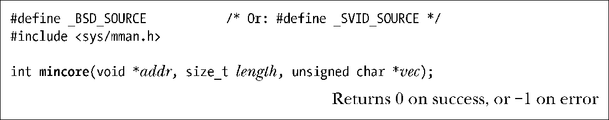
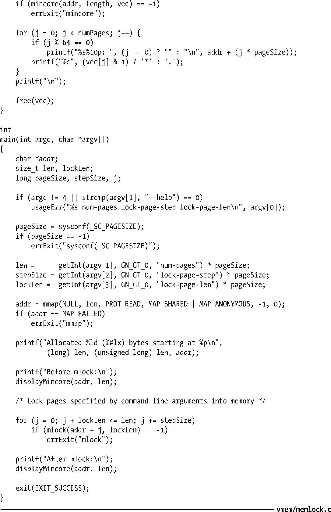
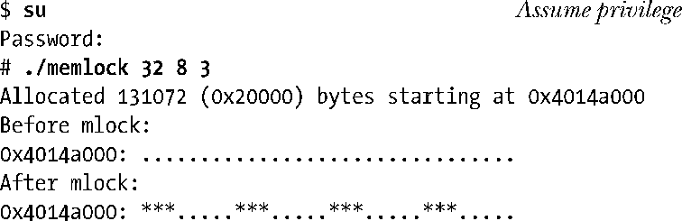

### 50.3　确定内存驻留性：mincore()

mincore()系统调用是内存加锁系统调用的补充，它报告在一个虚拟地址范围中哪些分页当前驻留在RAM中，因此在访问这些分页时也不会导致分页故障。

SUSv3并没有规定mincore()，很多UNIX实现都提供了这个函数，但不是所有的UNIX实现都提供了这个函数。在Linux上从内核2.4开始提供了mincore()。

mincore()系统调用返回起始地址为addr长度为length字节的虚拟地址范围中分页的内存驻留信息。addr中的地址必须是分页对齐的，并且由于返回的信息是有关整个分页的，因此length实际上会被向上舍入到系统分页大小的下一个整数倍。

内存驻留相关的信息会通过vec返回，它是一个数组，其大小为(length + PAGE_SIZE – 1) / PAGE_SIZE字节。（在Linux上，vec的类型是unsigned char *；在其他一些UNIX实现上，vec的类型为char *。）每个字节的最低有效位在相应分页驻留在内存中时会被设置，而其他位的设置在一些UNIX实现上是未定义的，因此可移植的应用程序应该只测试最低有效位。

mincore()返回的信息在执行调用的时刻与检查vec中的元素的时刻期间可能会发生变化。唯一能够确保保持驻留在内存中的分页是那些通过mlock()或mlockall()锁住的分页。

> 在Linux 2.6.21之前，各种各样的实现问题导致mincore()无法正确地报告MAP_PRIVATE映射和非线性映射（通过使用remap_file_pages()创建）的内存驻留信息。

程序清单50-2演示了如何使用mlock()和mincore()。这个程序首先分配并使用mmap()映射了一块内存区域，然后以固定的时间间隔使用mlock()将整个区域或一组分页锁进内存。（传给这个程序的所有命令行参数的单位是分页，程序会将这些参数转换成字节，因为mmap()、mlock()以及mincore()使用的是字节。）在调用mlock()之前和之后，程序使用mincore()来获取这个区域中分页的内存驻留信息并图形化地将这些信息展现了出来。

程序清单50-2：使用mlock()和mincore()

下面的shell会话给出了运行程序清单50-2中的程序时输出。在这个例子中分配了32个分页，每组为8个分页，并给三个连续分页加锁。

在程序输出中，点表示分页不在内存中，星号表示分页驻留在内存中。从最后一行输出中可以看出，每组8个分页中有3个分页是驻留在内存中的。

在这个例子中假设了超级用户特权，这样程序就能够使用mlock()。从Linux 2.6.9开始就无需这种特权了，只要待加锁的内存量不超过RLIMIT_MEMLOCK软资源限制即可。

