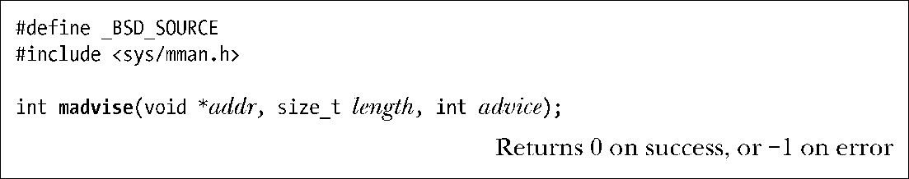

### 50.4　建议后续的内存使用模式：madvise()

madvise()系统调用通过通知内核调用进程对起始地址为addr长度为length字节的范围之内分页的可能的使用情况来提升应用程序的性能。内核可能会使用这种信息来提升在分页之下的文件映射上执行的I/O的效率。（有关文件映射的讨论可参考49.4节。）在Linux上从内核2.4开始提供了madvise()。

addr中的值必须是分页对齐的，length实际上会被向上舍入到系统分页大小的下一个整数倍。advice参数的取值为下列之一。

##### MADV_NORMAL

这是默认行为。分页是以簇的形式（较小的一个系统分页大小的整数倍）传输的。这个值会导致一些预先读和事后读。

##### MADV_RANDOM

这个区域中的分页会被随机访问，这样预先读将不会带来任何好处，因此内核在每次读取时所取出的数据量应该尽可能少。

##### MADV_SEQUENTIAL

在这个范围中的分页只会被访问一次，并且是顺序访问，因此内核可以激进地预先读，并且分页在被访问之后就可以将其释放了。

##### MADV_WILLNEED

预先读取这个区域中的分页以备将来的访问之需。MADV_WILLNEED操作的效果与Linux特有的readahead()系统调用和posix_fadvise() POSIX_FADV_WILLNEED操作的效果类似。

##### MADV_DONTNEED

调用进程不再要求这个区域中的分页驻留在内存中。这个标记的精确效果在不同UNIX实现上是不同的。下面首先对其在Linux上的行为予以介绍。对于MAP_PRIVATE区域来讲，映射分页会显式地被丢弃，这意味着所有发生在分页上的变更会丢失。虚拟内存地址范围仍然可访问，但对各个分页的下一个访问将会导致一个分页故障和分页的重新初始化，这种初始化要么使用其映射的文件内容，要么在匿名映射的情况下就使用零来初始化。这个标记可以作为一种显式初始化一个MAP_PRIVATE区域的内容的方法。对于MAP_SHARED区域来讲，内核在一些情况下可能会丢弃修改过的分页，这取决于运行系统的架构（在x86上不会发生这种行为）。其他一些UNIX实现的行为方式与Linux一样，但在一些UNIX实现上，MADV_DONTNEED仅仅是通知内核指定的分页在必要的时候可以被交换出去。可移植的应用程序不应该依赖于MADV_DONTNEED在Linux上的破坏性语义。

> Linux 2.6.16增加了三个新的非标准advice值：MADV_DONTFORK、MADV_DOFORK以及MADV_REMOVE。Linux 2.6.32和2.6.33又增加了四个非标准的advice值：MADV_HWPOISON、MADV_SOFT_OFFLINE、MADV_MERGEABLE以及MADV_UNMERGEABLE。这些值是在特殊情况下使用的，具体可参考madvise(2)手册。

大多数UNIX实现都提供了一个madvise()，它们通常至少支持上面描述的advice常量。然而SUSv3使用了一个不同的名称来标准化了这个API，即posix_madvise()，并且在相应的advice常量上加上了一个前缀字符串POSIX_。因此，这些常量变成了POSIX_MADV_NORMAL、POSIX_MADV_RANDOM、POSIX_MADV_SEQUENTIAL、POSIX_MADV_WILLNEED以及POSIX_MADV_DONTNEED。在glibc中（2.2以及之后的版本）是通过调用madvise()来实现这个候选接口的，但所有UNIX实现都没有提供这个接口。

> SUSv3表示posix_madvise()不应该影响一个程序的语义。然而在版本2.7之前的glibc中，POSIX_MADV_DONTNEED操作是通过使用madvise() MADV_DONTNEED来实现的，而正如之前描述的那样，这个操作会影响一个程序的语义。自glibc 2.7开始，posix_madvise()包装器将POSIX_MADV_DONTNEED实现为不做任何事情，这样它就不会影响一个程序的语义了。

