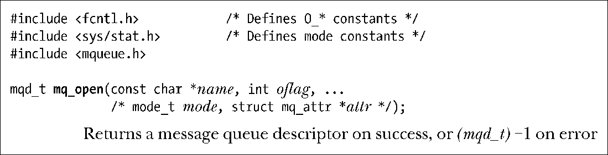
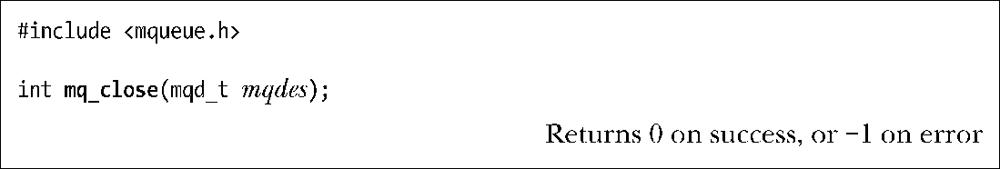
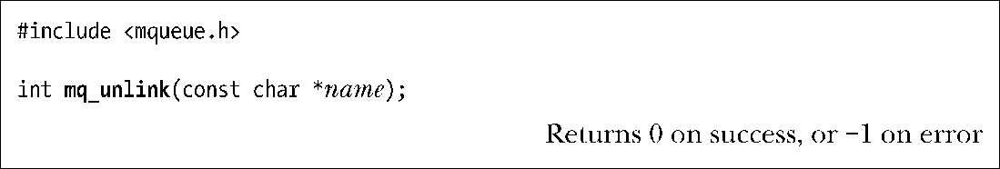
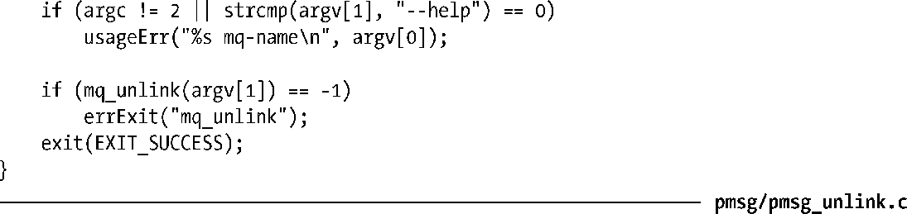

### 52.2　打开、关闭和断开链接消息队列

本节将介绍用来打开、关闭和删除消息队列的函数。

#### 打开一个消息队列

mq_open()函数创建一个新消息队列或打开一个既有队列。

name参数标识出了消息队列，其取值需要遵循51.1节中给出的规则。

oflag参数是一个位掩码，它控制着mq_open()操作的各个方面。表52-1对这个掩码中可以包含的值进行了总结。

<b class="my_markdown">表52-1：mq_open() oflag参数的位值</b>

| 标　　记 | 描　　述 |
| :-----  | :-----  | :-----  | :-----  |
| O_CREAT | O_EXCL | 队列不存在时创建队列 | 与O_CREAT一起排它地创建队列 |
| O_RDONLY | O_WRONLY | O_RDWR | 只读打开 | 只写打开 | 读写打开 |
| O_NONBLOCK | 以非阻塞模式打开 |

oflag参数的其中一个用途是，确定是打开一个既有队列还是创建和打开一个新队列。如果在oflag中不包含O_CREAT，那么将会打开一个既有队列。如果在oflag中包含了O_CREAT，并且与给定的name对应的队列不存在，那么就会创建一个新的空队列。如果在oflag中同时包含O_CREAT和O_EXCL，并且与给定的name对应的队列已经存在，那么mq_open()就会失败。

oflag参数还能够通过包含O_RDONLY、O_WRONLY以及O_RDWR这三个值中的一个来表明调用进程在消息队列上的访问方式。

剩下的一个标记值O_NONBLOCK将会导致以非阻塞的模式打开队列。如果后续的mq_receive()或mq_send()调用无法在不阻塞的情况下执行，那么调用就会立即返回EAGAIN错误。

mq_open()通常用来打开一个既有消息队列，这种调用只需要两个参数，但如果在flags中指定了O_CREAT，那么就还需要另外两个参数：mode和attr。（如果通过name指定的队列已经存在，那么这两个参数会被忽略。）这些参数的用法如下。

+ mode参数是一个位掩码，它指定了施加于新消息队列之上的权限。这个参数可取的位值与文件上的掩码值（表15-4）是一样的，并且与open()一样，mode中的值会与进程的umask（15.4.6节）取掩码。要从一个队列中读取消息（mq_receive()）就必须要将读权限赋予相应的用户，要向队列写入消息（mq_send()）就需要写权限。
+ attr参数是一个mq_attr结构，它指定了新消息队列的特性。如果attr为NULL，那么将使用实现定义的默认特性创建队列。在52.4节中将会对mq_attr结构进行介绍。

mq_open()在成功结束时会返回一个消息队列描述符，它是一个类型为mqd_t的值，在后续的调用中将会使用它来引用这个打开着的消息队列。SUSv3对这个数据类型的唯一约束是它不能是一个数组，即需要确保这个类型是一个能在赋值语句中使用或能作为函数参数传递的的类型。（如在Linux上，mqd_t是一个int，而在Solaris上将其定义为void *。）

程序清单52-2给出了一个使用mq_open()的例子。

#### fork()、exec()以及进程终止对消息队列描述符的影响

在fork()中子进程会接收其父进程的消息队列描述符的副本，并且这些描述符会引用同样的打开着的消息队列描述。（在52.3节中将会对消息队列描述进行介绍。）子进程不会继承其父进程的任何消息通知注册。

当一个进程执行了一个exec()或终止时，所有其打开的消息队列描述符会被关闭。关闭消息队列描述符的结果是进程在相应队列上的消息通知注册会被注销。

#### 关闭一个消息队列

mq_close()函数关闭消息队列描述符mqdes。

如果调用进程已经通过mqdes在队列上注册了消息通知（52.6节），那么通知注册会自动被删除，并且另一个进程可以随后向该队列注册消息通知。

当进程终止或调用exec()时，消息队列描述符会被自动关闭。与文件描述符一样，应用程序应该在不再使用消息队列描述符的时候显式地关闭消息队列描述符以防止出现进程耗尽消息队列描述符的情况。

与文件上的close()一样，关闭一个消息队列并不会删除该队列。要删除队列则需要使用mq_unlink()，它是unlink()在消息队列上的版本。

#### 删除一个消息队列

mq_unlink()函数删除通过name标识的消息队列，并将队列标记为在所有进程使用完该队列之后销毁该队列（这可能意味着会立即删除，前提是所有打开该队列的进程已经关闭了该队列）。

程序清单52-1示了mq_unlink()的用法。

程序清单52-1：使用mq_unlink()断开一个POSIX消息队列的链接

