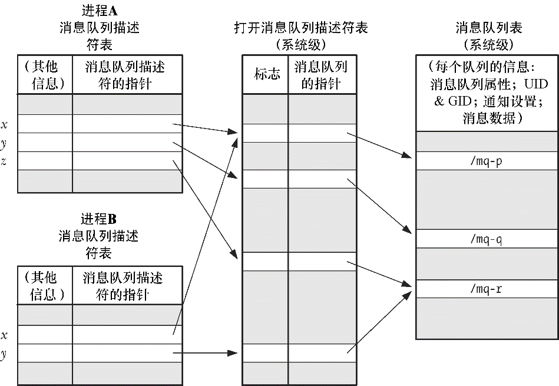

### 52.3　描述符和消息队列之间的关系

消息队列描述符和打开着的消息队列之间的关系与文件描述符和打开着的文件描述符之间的关系类似（见图5-2）。消息队列描述符是一个进程级别的句柄，它引用了系统层面的打开着的消息队列描述表中的一个条目，而该条目则引用了一个消息队列对象。图52-1对这种关系进行了描绘。

> 在Linux上，POSIX消息队列被实现成了虚拟文件系统中的i-node，并且消息队列描述符和打开着的消息队列描述分别被实现成了文件描述符和打开着的文件描述。然而SUSv3没有对实现细节进行规定，并且一些UNIX实现也并没有采用这种实现方式。在52.7节中将会对这个话题进行讨论，因为Linux正是由于采用了这种实现方式才得以提供了一些非标准的特性。

图52-1有助于阐明消息队列描述符的使用方面的细节问题（所有这些都与文件描述符的使用类似）。

<b class="my_markdown">图52-1：POSIX消息队列的内核数据结构之间的关系</b>

+ 一个打开的消息队列描述拥有一组关联的标记。SUSv3只规定了一种这样的标记，即NONBLOCK，它确定了I/O是否是非阻塞的。
+ 两个进程能够持有引用同一个打开的消息队列描述的消息队列描述符（图中的描述符x）。当一个进程在打开了一个消息队列之后调用fork()时就会发生这种情况。这些描述符会共享O_NONBLOCK标记的状态。
+ 两个进程能够持有引用不同消息队列描述（它们引用了同一个消息队列）的打开的消息队列描述（如进程A中的描述符z和进程B中的描述符y都引用了/mq-r）。当两个进程分别使用mq_open()打开同一个队列时就会发生这种情况。

