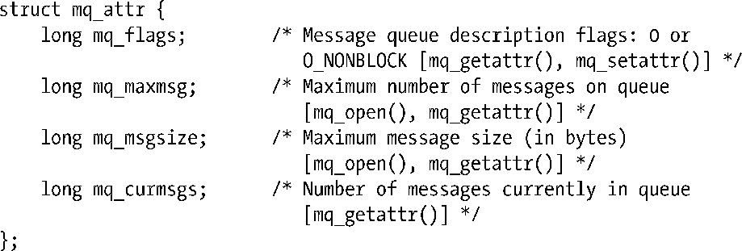
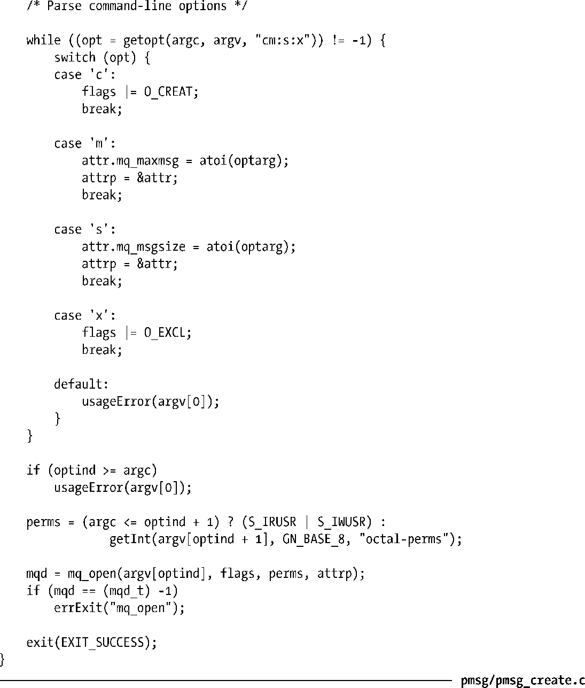
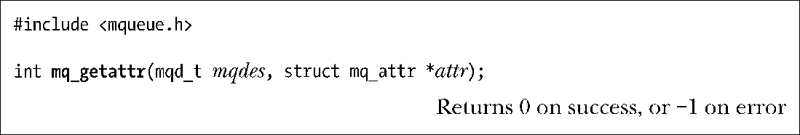
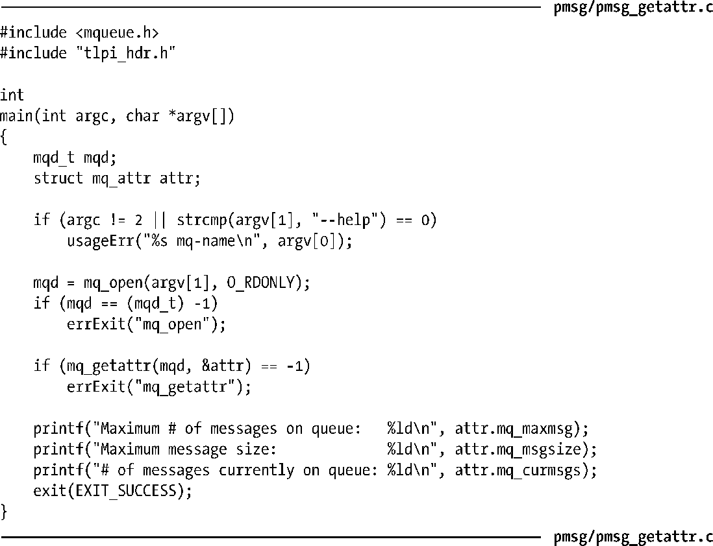
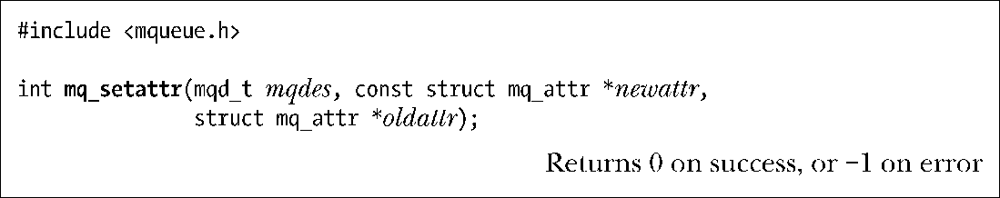
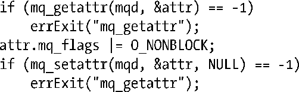

### 52.4　消息队列特性

mq_open()、mq_getattr()以及mq_setattr()函数都会接收一个参数，它是一个指向mq_attr结构的指针。这个结构是在<mqueue.h>中进行定义的，其形式如下。

在开始深入介绍mq_attr的细节之前有必要指出以下几点。

+ 这三个函数中的每个函数都只用到了其中几个字段。上面给出的结构定义中的注释指出了各个函数所用到的字段。
+ 这个结构包含了与一个消息描述符相关联的打开的消息队列描述（mq_flags）的相关信息以及该描述符所引用的队列的相关信息（mq_maxmsg、mq_msgsize、mq_curmsgs）。
+ 其中一些字段中包含的信息在使用mq_open()创建队列时就已经确定下来了（mq_maxmsg和mq_msgsize）；其他字段则会返回消息队列描述（mq_flags）或消息队列（mq_curmsgs）的当前状态的相关信息。

#### 在创建队列时设置消息队列特性

在使用mq_open()创建消息队列时可以通过下列mq_attr字段来确定队列的特性。

+ mq_maxmsg字段定义了使用mq_send()向消息队列添加消息的数量上限，其取值必须大于0。
+ mq_msgsize字段定义了加入消息队列的每条消息的大小的上限，其取值必须大于0。

内核根据这两个值来确定消息队列所需的最大内存量。

mq_maxmsg和mq_msgsize特性是在消息队列被创建时就确定下来的，并且之后也无法修改这两个特性。在52.8节中将会介绍两个/proc文件，它们为mq_maxmsg和mq_msgsize特性的取值设定了一个系统层面的限制。

程序清单52-2中的程序为mq_open()函数提供了一个命令行界面并展示了在mq_open()中如何使用mq_attr结构。

消息队列特性可以通过两个命令行参数来指定：–m用于指定mq_maxmsg，–s用于指定mq_msgsize。只要指定了其中一个选项，那么一个非NULL的attrp参数就会被传递给mq_open()。如果在命令行中只指定了–m和–s选项中的一个，那么attrp指向的mq_attr结构中的一些字段就会取默认值。如果两个选项都被没有被指定，那么在调用mq_open()时会将attrp指定为NULL，这将会导致使用由实现定义的队列特性的默认值来创建队列。

程序清单52-2：创建一个POSIX消息队列

#### 获取消息队列特性

mq_getattr()函数返回一个包含与描述符mqdes相关联的消息队列描述和消息队列的相关信息的mq_attr结构。

除了上面已经介绍的mq_maxmsg和mq_msgsize字段之外，attr指向的返回结构中还包含下列字段。

##### mq_flags

这些是与描述符mqdes相关联的打开的消息队列描述的标记，其取值只有一个：O_NONBLOCK。这个标记是根据mq_open()的oflag参数来初始化的，并且使用mq_setattr()可以修改这个标记。

##### mq_curmsgs

这个当前位于队列中的消息数。这个信息在mq_getattr()返回时可能已经发生了改变，前提是存在其他进程从队列中读取消息或向队列写入消息。

程序清单52-3中的程序使用了mq_getattr()来获取通过命令行参数指定的消息队列的特性，然后在标准输出中显示这些特性。

程序清单52-3：获取POSIX消息队列特性

下面的shell会话使用了程序清单52-2中的程序来创建一个消息队列并使用实现定义的默认值来初始化其特性（即传入mq_open()的最后一个参数为NULL），然后使用程序清单52-3中的程序来显示队列特性，这样就能够看到Linux上的默认设置了。

从上面的输出中可以看出Linux上mq_maxmsg和mq_msgsize的默认取值分别为10和8192。

mq_maxmsg和mq_msgsize的默认取值在不同的实现上差异很大。可移植的应用程序一般都需要显式地为这两个特性选取相应的值，而不是依赖于默认值。

#### 修改消息队列特性

mq_setattr()函数设置与消息队列描述符mqdes相关联的消息队列描述的特性，并可选地返回与消息队列有关的信息。

mq_setattr()函数执行下列任务。

+ 它使用newattr指向的mq_attr结构中的mq_flags字段来修改与描述符mqdes相关联的消息队列描述的标记。
+ 如果oldattr不为NULL，那么就返回一个包含之前的消息队列描述标记和消息队列特性的mq_attr结构（即与mq_getattr()执行的任务一样）。

SUSv3规定使用mq_setattr()能够修改的唯一特性是O_NONBLOCK标记的状态。

为支持一个特定的实现可能会定义其他可修改的标记或SUSv3后面可能会增加新的标记，一个可移植的应用程序应该通过使用mq_getattr()来获取mq_flags值并修改O_NONBLOCK位来修改O_NONBLOCK标记的状态以及调用mq_setattr()来修改mq_flags设置。如为启用O_NONBLOCK需要编写下列代码：

