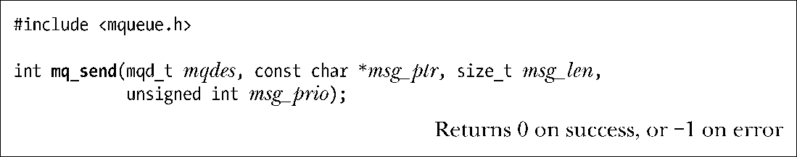
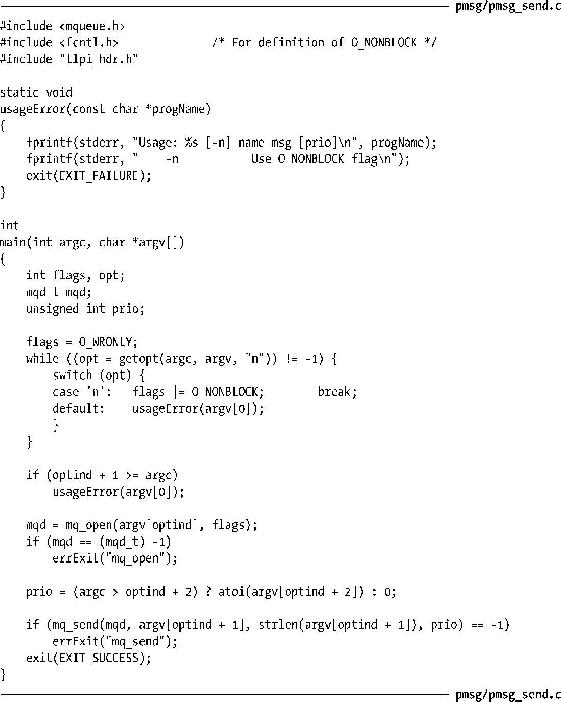

### 52.5.1　发送消息

mq_send()函数将位于msg_ptr指向的缓冲区中的消息添加到描述符mqdes所引用的消息队列中。

msg_len参数指定了msg_ptr指向的消息的长度，其值必须小于或等于队列的mq_msgsize特性，否则mq_send()就会返回EMSGSIZE错误。长度为零的消息是允许的。

每条消息都拥有一个用非负整数表示的优先级，它通过msg_prio参数指定。消息在队列中是按照优先级倒序排列的（即0表示优先级最低）。当一条消息被添加到队列中时，它会被放置在队列中具有相同的优先级的所有消息之后。如果一个应用程序无需使用消息优先级，那么只需要将msg_prio指定为0即可。

> 本章开头部分提及过System V消息的类型特性的功能是不同的。System V消息总是按照FIFO的顺序排列，但msgrcv()能够按照多种方式来选择消息：按照FIFO的顺序、根据类型来选择、或者选取类型值小于或等于某个特定值的消息中类型值最大的消息。

SUSv3允许一个实现为消息优先级规定一个上限，这可以通过定义常量MQ_PRIO_MAX或通过规定sysconf(_SC_MQ_PRIO_MAX)的返回值来完成。SUSv3要求这个上限至少是32（_POSIX_MQ_PRIO_MAX），即优先级的取值范围至少为0到31，但各个实现规定的实际取值范围则存在着很大的差异，如在Linux上，这个常量值为32768，而在Solaris上这个常量值为32，在Tru64则为256。

如果消息队列已经满了（即已经达到了队列的mq_maxmsg限制），那么后续的mq_send()调用会阻塞直到队列中存在可用空间为止或者在O_NONBLOCK标记起作用时立即失败并返回EAGAIN错误。

程序清单52-4中的程序为mq_send()函数提供了一个命令行界面，下一节将会演示如何使用这个程序。

程序清单52-4：向POSIX消息队列写入一条消息

