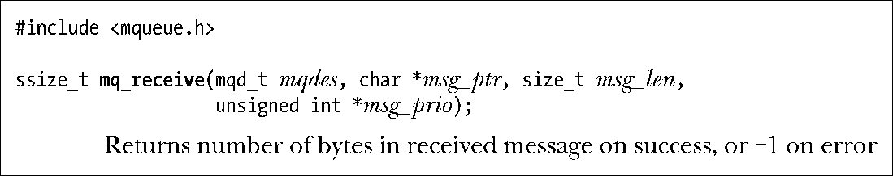
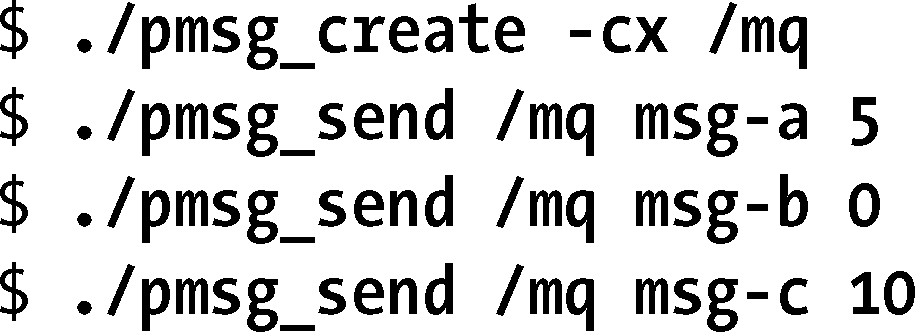
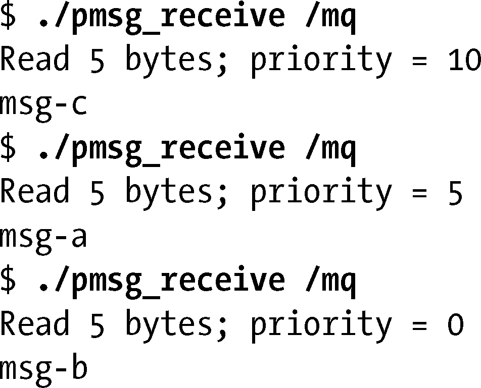
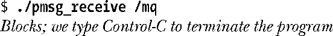
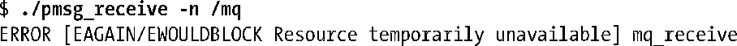
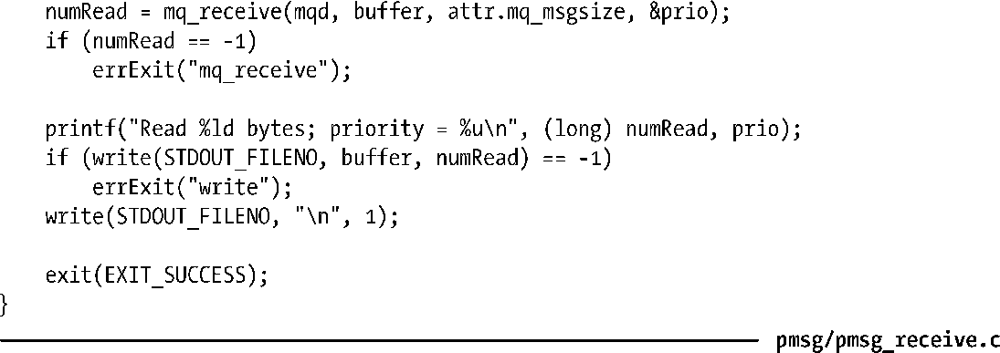

### 52.5.2　接收消息

mq_receive()函数从mqdes引用的消息队列中删除一条优先级最高、存在时间最长的消息并将删除的消息放置在msg_ptr指向的缓冲区。

调用者使用msg_len参数来指定msg_ptr指向的缓冲区中的可用字节数。

不管消息的实际大小是什么，msg_len（即msg_ptr指向的缓冲区的大小）必须要大于或等于队列的mq_msgsize特性，否则mq_receive()就会失败并返回EMSGSIZE错误。如果不清楚一个队列的mq_msgsize特性的值，那么可以使用mq_getattr()来获取这个值。（在一个包含多个协作进程的应用程序中一般无需使用mq_getattr()，因为应用程序通常能够提前确定队列的mq_msgsize设置。）

如果msg_prio不为NULL，那么接收到的消息的优先级会被复制到msg_prio指向的位置处。

如果消息队列当前为空，那么mq_receive()会阻塞直到存在可用的消息或在O_NONBLOCK标记起作用时会立即失败并返回EAGAIN错误。（管道就不存在类似的行为，即当一端不存在写者时读者不会看到文件结束。）

程序清单52-5中的程序为mq_receive()函数提供了一个命令行界面，在usageError()函数中给出了这个程序的命令格式。

下面的shell会话演示了程序清单52-4和程序清单52-5中的程序的用法。首先创建了一个消息队列并向其发送了一些具备不同优先级的消息。

然后执行一系列命令来从队列中接收消息。

从上面的输出中可以看出，消息的读取是按照优先级来进行的。

此刻，这个队列是空的。当再次执行阻塞式接收时，操作就会阻塞。

另一方面，如果执行了一个非阻塞接收，那么调用就会立即返回一个失败状态。

程序清单52-5：从POSIX消息队列中读取一条消息

