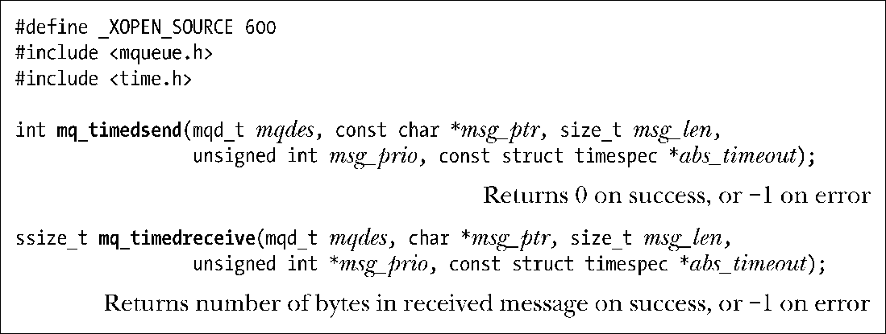

### 52.5.3　在发送和接收消息时设置超时时间

mq_timedsend()和mq_timedreceive()函数与mq_send()和mq_receive()几乎是完全一样的，它们之间唯一的差别在于如果操作无法立即被执行，并且该消息队列描述上的O_NONBLOCK标记不起作用，那么abs_timeout参数就会为调用阻塞的时间指定一个上限。

abs_timeout参数是一个timespec结构（23.4.2节），它将超时时间描述为自新纪元到现在的一个绝对值，其单位为秒数和纳秒数。要指定一个相对超时则可以使用clock_gettime()来获取CLOCK_REALTIME时钟的当前值并在该值上加上所需的时间量来生成一个恰当初始化过的timespec结构。

如果mq_timedsend()或mq_timedreceive()调用因超时而无法完成操作，那么调用就会失败并返回ETIMEDOUT错误。

在Linux上将abs_timeout指定为NULL表示永远不会超时，但这种行为并没有在SUSv3中得到规定，因此可移植的应用程序不应该依赖这种行为。

mq_timedsend()和mq_timedreceive()函数最初源自POSIX.1d (1999)，所有UNIX实现都没有提供这两个函数。

