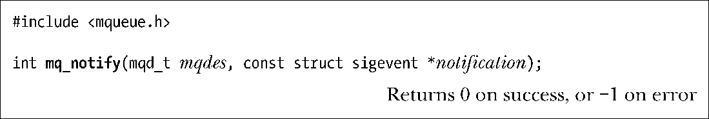
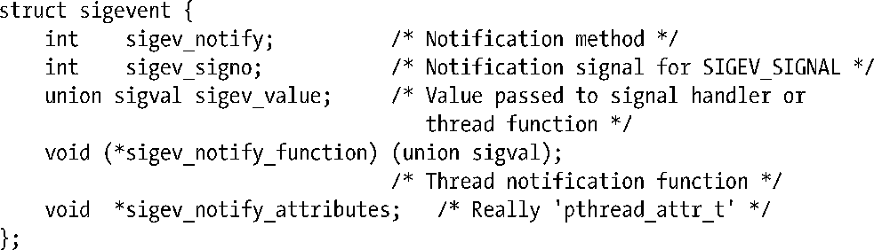

### 52.6　消息通知

POSIX消息队列区别于System V消息队列的一个特性是POSIX消息队列能够接收之前为空的队列上有可用消息的异步通知（即队列从空变成了非空）。这个特性意味着已经无需执行一个阻塞的调用或将消息队列描述符标记为非阻塞并在队列上定期执行mq_receive()调用（“拉”）了，因为一个进程能够请求消息到达通知，然后继续执行其他任务直到收到通知为止。进程可以选择通过信号的形式或通过在一个单独的线程中调用一个函数的形式来接收通知。

POSIX消息队列的通知特性与23.6节中介绍的POSIX定时器通知工具类似。（这两组API都源自POSIX.1b。）

mq_notify()函数注册调用进程在一条消息进入描述符mqdes引用的空队列时接收通知。

notification参数指定了进程接收通知的机制。在深入介绍notification参数的细节之前，有关消息通知需要注意以下几点。

+ 在任何一个时刻都只有一个进程（“注册进程”）能够向一个特定的消息队列注册接收通知。如果一个消息队列上已经存在注册进程了，那么后续在该队列上的注册请求将会失败（mq_notify()返回EBUSY错误）。
+ 只有当一条新消息进入之前为空的队列时注册进程才会收到通知。如果在注册的时候队列中已经包含消息，那么只有当队列被清空之后有一条新消息达到之时才会发出通知。
+ 当向注册进程发送了一个通知之后就会删除注册信息，之后任何进程就能够向队列注册接收通知了。换句话说，只要一个进程想要持续地接收通知，那么它就必须要在每次接收到通知之后再次调用mq_notify()来注册自己。
+ 注册进程只有在当前不存在其他在该队列上调用mq_receive()而发生阻塞的进程时才会收到通知。如果其他进程在mq_receive()调用中被阻塞了，那么该进程会读取消息，注册进程会保持注册状态。
+ 一个进程可以通过在调用mq_notify()时传入一个值为NULL的notification参数来撤销自己在消息通知上的注册信息。

在23.6.1节中已经对notification参数的类型sigevent结构进行了介绍。下面给出的是该结构的一个简化版本，它只列出了与mq_notify()相关的字段。

这个结构的sigev_notify字段将会被设置成下列值中的一个。

##### SIGEV_NONE

注册这个进程接收通知，但当一条消息进入之前为空的队列时不通知该进程。与往常一样，当新消息进入空队列之后注册信息会被删除。

##### SIGEV_SIGNAL

通过生成一个在sigev_signo字段中指定的信号来通知进程。如果sigev_signo是一个实时信号，那么sigev_value字段将会指定信号都带的数据（22.8.1节）。通过传入信号处理器的siginfo_t结构中的si_value字段或通过调用sigwaitinfo()或sigtimedwait()返回值能够取得这部分数据。siginfo_t结构中的下列字段也会被填充：si_code，其值为SI_MESGQ；si_signo，其值是信号编号；si_pid，其值是发送消息的进程的进程ID；以及si_uid，其值是发送消息的进程的真实用户ID。（si_pid和si_uid字段在其他大多数实现上不会被设置。）

##### SIGEV_THREAD

通过调用在sigev_notify_function中指定的函数来通知进程，就像是在一个新线程中启动该函数一样。sigev_notify_attributes字段可以为NULL或是一个指向定义了线程的特性的pthread_attr_t结构的指针（29.8节）。sigev_value中指定的联合sigval值将会作为参数传入这个函数。

