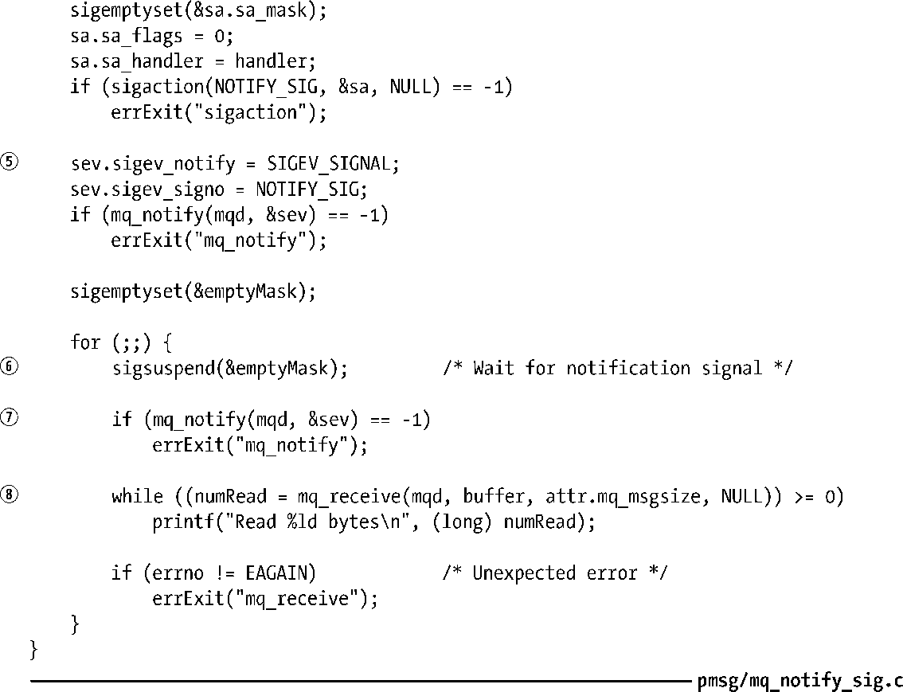

### 52.6.1　通过信号接收通知

程序清单52-6提供了一个使用信号来进行消息通知的例子。这个程序执行了下列任务。

**1．** 以非阻塞模式打开了一个通过命令行指定名称的消息队列①，确定了该队列的mq_msgsize特性的值②，并分配了一个大小为该值的缓冲区来接收消息③。

**2．** 阻塞通知信号（SIGUSR1）并为其建立一个处理器④。

**3．** 首次调用mq_notify()来注册进程接收消息通知⑤。

**4．** 执行一个无限循环，在循环中执行下列任务。

(a)调用sigsuspend()，该函数会解除通知信号的阻塞状态并等待直到信号被捕获⑥。从这个系统调用中返回表示已经发生了一个消息通知。此刻，进程会撤销消息通知的注册信息。

(b)调用mq_notify()重新注册进程接收消息通知⑦。

(c)执行一个while循环从队列中尽可能多地读取消息以便清空队列⑧。

程序清单52-6：通过信号接收消息通知

在程序清单52-6中的程序中存在很多方面值得详细解释。

+ 程序阻塞了通知信号并使用sigsuspend()来等待该信号，而没有使用pause()，这是为了防止出现程序在执行for循环中的其他代码（即没有因等待信号而阻塞）时错过信号的情况。如果发生了这种情况，并且使用了pause()来等待信号，那么下次调用pause()时会阻塞，即使系统已经发出了一个信号。
+ 程序以非阻塞模式打开了队列，并且当一个通知发生之后使用一个while循环来读取队列中的所有消息。通过这种方式来清空队列能够确保当一条新消息到达之后会产生一个新通知。使用非阻塞模式意味着while循环在队列被清空之后就会终止（mq_receive()会失败并返回EAGAIN错误）。（这种做法与63.1.1节中介绍的采用边界触发I/O通知的非阻塞I/O类似，而这里之所以采用这种做法的原因也是类似的。）
+ 在for循环中比较重要的一点是在读取队列中的所有消息之前重新注册接收消息通知。如果颠倒了顺序，如按照下面的顺序：队列中的所有消息都被读取了，while循环终止；另一个消息被添加到了队列中；mq_notify()被调用以重新注册接收消息通知。此刻，系统将不会产生新的通知信号，因为队列已经非空了，其结果是程序在下次调用sigsuspend()时会永远阻塞。

