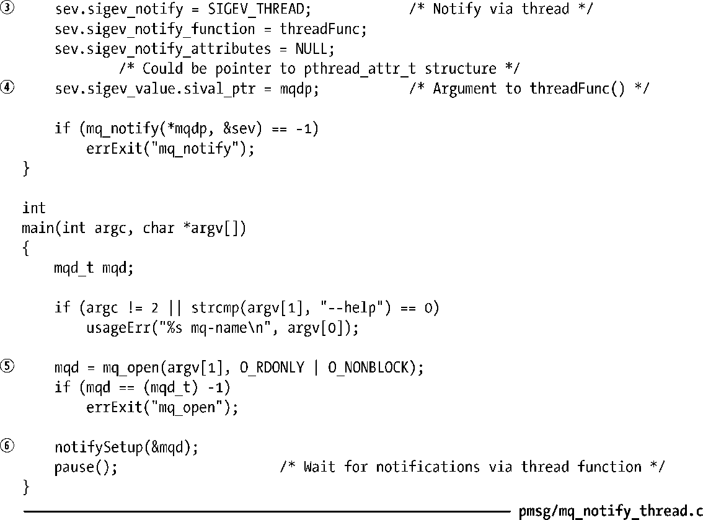

### 52.6.2　通过线程接收通知

程序清单52-7提供了一个使用线程来发布消息通知的例子。这个程序与程序清单52-6中的程序具备一些共同的设计特点。

+ 当消息通知发生时，程序会在清空队列之前重新启用通知②。
+ 采用了非阻塞模式使得在接收到一个通知之后可以在无需阻塞的情况下完全清空队列⑤。

程序清单52-7：通过线程来接收消息通知

有关程序清单52-7中的程序的设计还需要注意以下几点。

+ 程序通过一个线程来请求通知需要将传入mq_notify()的sigevent结构的sigev_notify字段的值指定为SIGEV_THREAD。线程的启动函数threadFunc()是通过sigev_notify_function字段来指定的③。
+ 在启用消息通知之后，主程序会永远中止⑥；定时器通知是通过在一个单独的线程中调用threadFunc()来分发的①。
+ 本来可以通过将消息队列描述符mqd变成一个全局变量使之对threadFunc()可见，但这里采用了一种不同的做法：将消息队列描述符的地址放在了传给mq_notify()的sigev_value.sival_ptr字段中④。当后面调用threadFunc()时，这个参数会作为其参数被传入到该函数中。

> 必须要把指向消息队列描述符的指针赋给sigev_value.sival_ptr，而不是把描述符本身（可能需要某种转换）赋给sigev_value.sival_ptr，因为SUSv3除了规定它不是一个数组类型之外并没有对其性质和用来表示mqd_t数据类型的类型大小予以规定。

