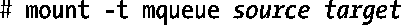
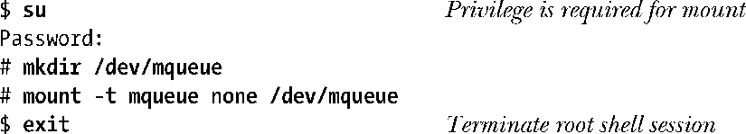
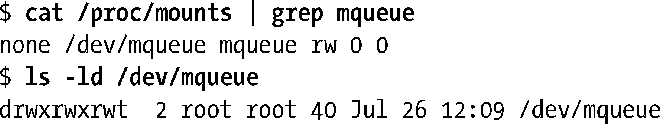
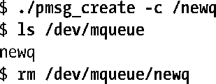
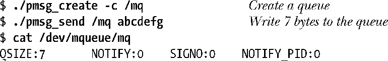

### 52.7　Linux特有的特性

POSIX消息队列在Linux上的实现提供了一些非标准的却相当有用的特性。

#### 通过命令行显示和删除消息队列对象

在51章中提到过POSIX IPC对象被实现成了虚拟文件系统中的文件，并且可以使用ls和rm来列出和删除这些文件。为列出和删除POSIX消息队列就必须要使用形如下面的命令来将消息队列挂载到文件系统中。

source可以是任意一个名字（通常将其指定为字符串none），其唯一的意义是它将出现在/proc/mounts中并且mount和df命令会显示出这个名字。target是消息队列文件系统的挂载点。

下面的shell会话显示了如何挂载消息队列文件系统和显示其内容。首先为文件系统创建一个挂载点并挂载它。

接着显示新挂载在/proc/mounts中的记录，然后显示挂载目录上的权限。

在ls命令的输出中需要注意的一点是消息队列文件系统在挂载时会自动为挂载目录设置粘滞位。（从ls的输出中的other-execute权限字段中有一个t就可以看出这一点。）这意味着非特权进程只能在它所拥有的消息队列上执行断开链接的操作。

接着创建一个消息队列，使用ls来表明它在文件系统中是可见的，然后删除该消息队列。

#### 获取消息队列的相关信息

可以显示消息队列文件系统中的文件的内容，每个虚拟文件都包含了其关联的消息队列的相关信息。

QSIZE字段的值为队列中所有数据的总字节数，剩下的字段则与消息通知相关。如果NOTIFY_PID为非零，那么进程ID为该值的进程已经向该队列注册接收消息通知了，剩下的字段则提供了与这种通知相关的信息。

+ NOTIFY是一个与其中一个sigev_notify常量对应的值：0表示SIGEV_SIGNAL，1表示SIGEV_NONE，2表示SIGEV_THREAD。
+ 如果通知方式是SIGEV_SIGNAL，那么SIGNO字段指出了哪个信号会用来分发消息通知。

下面的shell会话对这些字段中包含的信息进行了说明。

#### 使用另一种I/O模型操作消息队列

在Linux实现上，消息队列描述符实际上是一个文件描述符，因此可以使用I/O多路复用系统调用（select()和poll()）或epoll API来监控这个文件描述符。（有关这些API的更多细节请参考63章。）这样就能够避免在使用System V消息队列时同时等待一个消息队列和一个文件描述符上的输入的困难局面（参见46.9节）的出现。但这项特性不是标准特性，SUSv3并没有要求将消息队列描述符实现成文件描述符。

