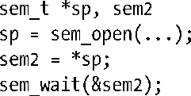
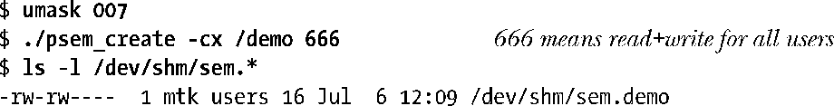
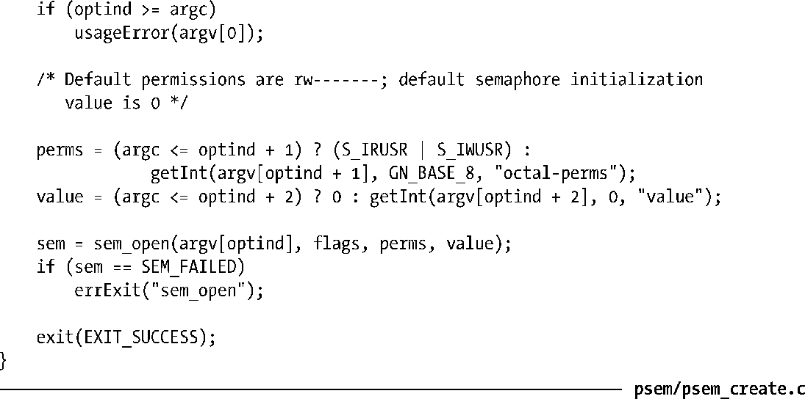

### 53.2.1　打开一个命名信号量

sem_open()函数创建和打开一个新的命名信号量或打开一个既有信号量。

name参数标识出了信号量，其取值需符合51.1节中给出的规则。

oflag参数是一个位掩码，它确定了是打开一个既有信号量还是创建并打开一个新信号量。如果oflag为0，那么将访问一个既有信号量。如果在oflag中指定了O_CREAT，并且与给定的name对应的信号量的不存在，那么就创建一个新信号量。如果在oflag中同时指定了O_CREAT和O_EXCL，并且与给定的name对应的信号量已经存在，那么sem_open()就会失败。

如果sem_open()被用来打开一个既有信号量，那么调用就只需要两个参数。但如果在flags中指定了O_CREAT，那么就还需要另外两个参数：mode和value。（如果与name对应的信号量已经存在，那么这两个参数会被忽略。）具体如下。

+ mode参数是一个位掩码，它指定了施加于新信号量之上的权限。这个参数能取的位值与文件上的位值是一样的（表15-4）并且与open()一样，mode参数中的值会根据进程的umask来取掩码（15.4.6节）。SUSv3并没有为oflag规定任何访问模式标记（O_RDONLY、O_WRONLY以及O_RDWR）。很多实现，包括Linux，在打开一个信号量时会将访问模式默认成O_RDWR，因为大多数使用信号量的应用程序都同时会用到sem_post()和sem_wait()，从而需要读取和修改一个信号量的值。这意味着需要确保将读权限和写权限赋给每一类需要访问这个信号量的用户——owner、group以及other。
+ value参数是一个无符号整数，它指定了新信号量的初始值。信号量的创建和初始化操作是原子的，这样就避免了System V信号量初始化时所需完成的复杂工作了（47.5节）。

不管是创建一个新信号量还是打开一个既有信号量，sem_open()都会返回一个指向一个sem_t值的指针，而在后续的调用中则可以通过这个指针来操作这个信号量。sem_open()在发生错误时会返回SEM_FAILED值。（在大多数实现上，SEM_FAILED被定义成了((sem_t *) 0)或((sem_t *) –1)）；Linux采用了前面一种定义。

SUSv3声称当在sem_open()的返回值指向的sem_t变量的副本上执行操作（sem_post()、sem_wait()等）时结果是未定义的。换句话说，像下面这种使用sem2的做法是不允许的。

通过fork()创建的子进程会继承其父进程打开的所有命名信号量的引用。在fork()之后，父进程和子进程就能够使用这些信号量来同步它们的动作了。

#### 示例程序

程序清单53-1为sem_open()函数提供了一个命令行界面。在usageError()函数中给出了这个程序的命令格式。

下面的shell会话日志演示了如何使用这个程序。首先使用umask命令来否决other用户的所有权限，然后互斥地创建一个信号量并查看包含该命名信号量的Linux特有的虚拟目录中的内容。

ls命令的输出表明进程的umask覆盖了为other用户指定的read+write权限。

如果再次使用同样的名字来互斥地创建一个信号量，那么这个操作就会失败，因为这个名字已经存在了。

程序清单53-1：使用sem_open()打开或创建一个POSIX命名信号量

