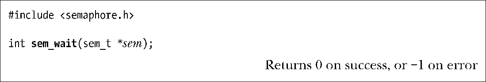
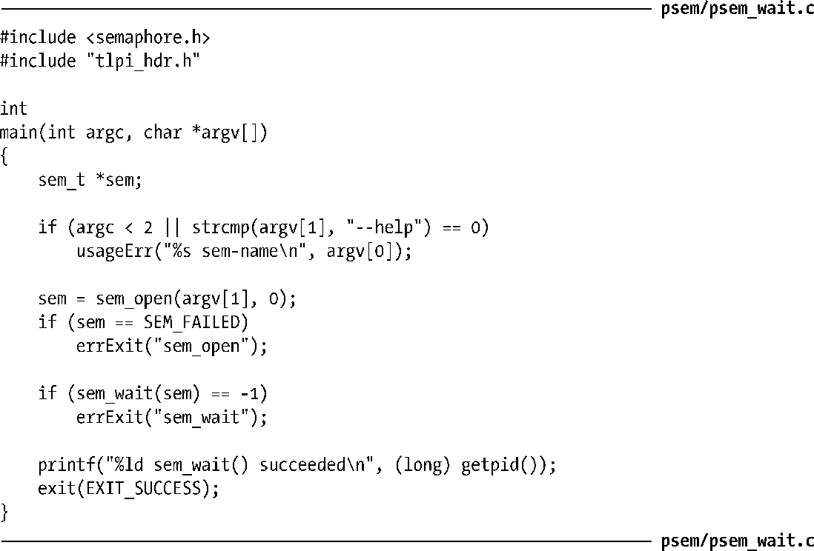
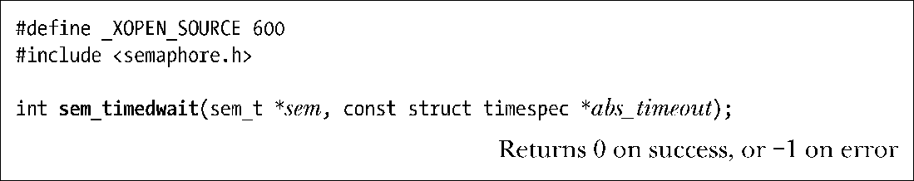

### 53.3.1　等待一个信号量

sem_wait()函数会递减（减小1）sem引用的信号量的值。

如果信号量的当前值大于0，那么sem_wait()会立即返回。如果信号量的当前值等于0，那么sem_wait()会阻塞直到信号量的值大于0为止，当信号量值大于0时该信号量值就被递减并且sem_wait()会返回。

如果一个阻塞的sem_wait()调用被一个信号处理器中断了，那么它就会失败并返回EINTR错误，不管在使用sigaction()建立这个信号处理器时是否采用了SA_RESTART标记。（在其他一些UNIX实现上，SA_RESTART会导致sem_wait()自动重启。）

程序清单53-3中的程序为sem_wait()函数提供了一个命令行界面，稍后就会演示如何使用这个程序。

程序清单53-3：使用sem_wait()来递减一个POSIX信号量

sem_trywait()函数是sem_wait()的一个非阻塞版本。

如果递减操作无法立即被执行，那么sem_trywait()就会失败并返回EAGAIN错误。

sem_timedwait()函数是sem_wait()的另一个变体，它允许调用者为调用被阻塞的时间量指定一个限制。

如果sem_timedwait()调用因超时而无法递减信号量，那么这个调用就会失败并返回ETIMEDOUT错误。

abs_timeout参数是一个结构（23.4.2节），它将超时时间表示成了自新纪元到现在为止的秒数和纳秒数的绝对值。如果需要指定一个相对超时时间，那么就必须要使用clock_gettime()获取CLOCK_REALTIME时钟的当前值并在该值上加上所需的时间量来生成一个适合在sem_timedwait()中使用的timespec结构。

sem_timedwait()函数最初是在POSIX.1d (1999)中进行规定的，所有UNIX实现都没有提供这个函数。

