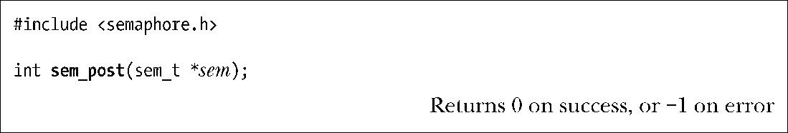
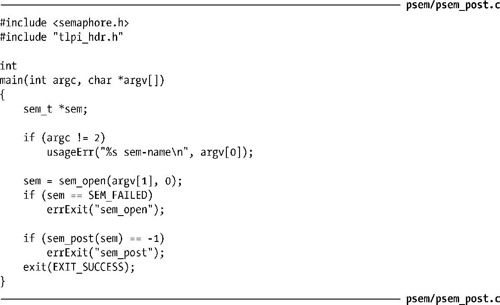

### 53.3.2　发布一个信号量

sem_post()函数递增（增加1）sem引用的信号量的值。

如果在sem_post()调用之前信号量的值为0，并且其他某个进程（或线程）正在因等待递减这个信号量而阻塞，那么该进程会被唤醒，它的sem_wait()调用会继续往前执行来递减这个信号量。如果多个进程（或线程）在sem_wait()中阻塞了，并且这些进程的调度采用的是默认的循环时间分享策略，那么哪个进程会被唤醒并允许递减这个信号量是不确定的。（与System V信号量一样，POSIX信号量仅仅是一种同步机制，而不是一种排队机制。）

> SUSv3规定如果进程或线程执行在实时调度策略下，那么优先级最高等待时间最长的进程或线程将会被唤醒。

与System V信号量一样，递增一个POSIX信号量对应于释放一些共享资源以供其他进程或线程使用。

程序清单53-4中的程序为sem_post()函数提供了一个命令行界面，稍后会演示如何使用这个程序。

程序清单53-4：使用sem_post()递增一个POSIX信号量

