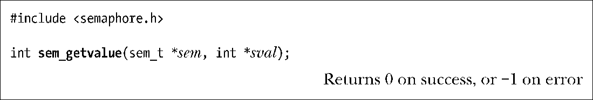
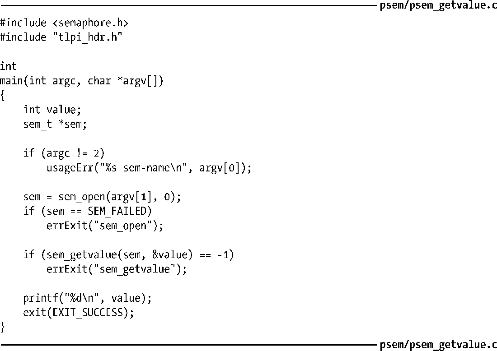
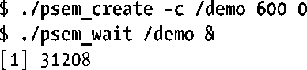
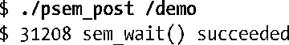
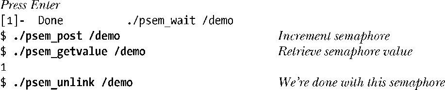

### 53.3.3　获取信号量的当前值

sem_getvalue()函数将sem引用的信号量的当前值通过sval指向的int变量返回。

如果一个或多个进程（或线程）当前正在阻塞以等待递减信号量值，那么sval中的返回值将取决于实现。SUSv3允许两种做法：0或一个绝对值等于在sem_wait()中阻塞的等待者数目的负数。Linux和其他一些实现采用了第一种行为，而另一些实现则采用了后一种行为。

> 尽管当存在被阻塞的等待者时在sval中返回一个负值是有用的，特别是对于调试来讲，但SUSv3并没有规定这种行为，因为一些系统用来高效地实现POSIX信号量的技术没有（实际上是无法）记录被阻塞的等待者的数目。

注意在sem_getvalue()返回时，sval中的返回值可能已经过时了。依赖于sem_getvalue()返回的信息在执行后续操作时未发生变化的程序将会碰到检查时、使用时（time-of-check、time-of-use）的竞争条件（38.6节）。

程序清单53-5使用了sem_getvalue()来获取名字通过命令行参数指定的信号量的值，然后在标准输出上显示该值。

程序清单53-5：使用sem_getvalue()获取一个POSIX信号量的值

#### 示例

下面的shell会话日志演示了如何使用本章中到目前为止给出的各个程序。首先创建了一个初始值为零的信号量，然后在后台启动一个递减这个信号量的程序。

后台命令将会阻塞，这是因为信号量的当前值为0，从而无法递减这个信号量。

接着获取这个信号量的值。

从上面可以看到值0。在其他一些实现上可能会看到值−1，表示存在一个进程正在等待这个信号量。

接着执行一个命令来递增这个信号量，这将会导致后台程序中被阻塞的sem_wait()调用完成执行。

（上面输出中的最后一行表明shell提示符会与后台作业的输出混合在一起。）

按下回车后就能看到下一个shell提示符，这也会导致shell报告已终止的后台作业的信息。接着在信号量上执行后续的操作。

