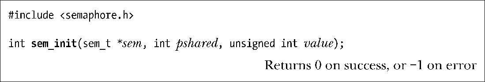
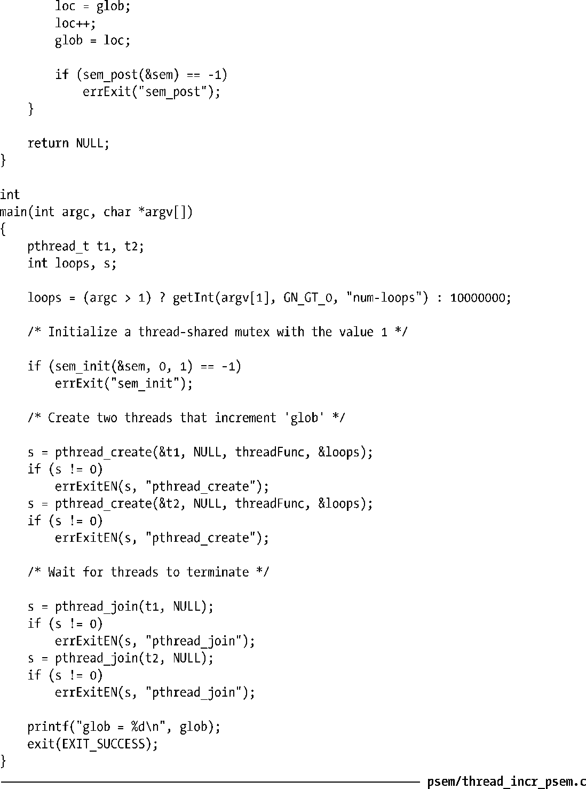

### 53.4.1　初始化一个未命名信号量

sem_init()函数使用value中指定的值来对sem指向的未命名信号量进行初始化。

pshared参数表明这个信号量是在线程间共享还是在进程间共享。

+ 如果pshared等于0，那么信号量将会在调用进程中的线程间进行共享。在这种情况下，sem通常被指定成一个全局变量的地址或分配在堆上的一个变量的地址。线程共享的信号量具备进程持久性，它在进程终止时会被销毁。
+ 如果pshared不等于0，那么信号量将会在进程间共享。在这种情况下，sem必须是共享内存区域（一个POSIX共享内存对象、一个使用mmap()创建的共享映射、或一个System V共享内存段）中的某个位置的地址。信号量的持久性与它所处的共享内存的持久性是一样的。（通过其中大部分技术创建的共享内存区域具备内核持久性。但共享匿名映射是一个例外，只要存在一个进程维持着这种映射，那么它就一直存在下去。）由于通过fork()创建的子进程会继承其父进程的内存映射，因此进程共享的信号量会被通过fork()创建的子进程继承，这样父进程和子进程也就能够使用这些信号量来同步它们的动作了。

之所以需要pshared参数是因为下列原因。

+ 一些实现不支持进程间共享的信号量。在这些系统上为pshared指定一个非零值会导致sem_init()返回一个错误。Linux直到内核2.6以及NPTL线程化技术的出现之后才开始支持未命名的进程间共享的信号量。（在老式的LinuxThreads实现中，如果为pshared指定了一个非零值，那么sem_init()就会失败并返回一个ENOSYS错误。）
+ 在同时支持进程间共享信号量和线程间共享信号量的实现上，指定采用何种共享方式是有必要的，因为系统必须要执行特殊的动作来支持所需的共享方式。提供此类信息还使得系统能够根据共享的种类来执行优化工作。

NPTL sem_init()实现会忽略pshared，因为不管采用何种共享方式都无需执行特殊的动作，但可移植的以及面向未来的应用程序应该为pshared指定一个恰当的值。

> SUSv3规定sem_init()在失败时返回−1，但并没有对成功时的返回值进行规定。然而大多数现代UNIX实现的手册上都声称在成功时会返回0。（一个值得注意的例外情况是Solaris，它对返回值的描述与SUSv3规范中的描述类似。但通过检查OpenSolaris的源代码可以发现在该实现上sem_init()成功时会返回0。）SUSv4对这种情况进行了矫正，规定sem_init()在成功时应该返回0。

未命名信号量不存在相关的权限设置（即sem_init()中并不存在在sem_open()中所需的mode参数）。对一个未命名信号量的访问将由进程在底层共享内存区域上的权限来控制。

SUSv3规定对一个已初始化过的未命名信号量进行初始化操作将会导致未定义的行为。换句话说，必须要将应用程序设计成只有一个进程或线程来调用sem_init()以初始化一个信号量。

与命名信号量一样，SUSv3声称在地址通过传入sem_init()的sem参数指定的sem_t变量的副本上执行操作的结果是未定义的，因此应该总是只在“最初的”信号量上执行操作。

#### 示例程序

在30.1.2节中给出了一个使用互斥体来保护一个存在两个线程访问同一个全局变量的临界区的程序（程序清单30-2）。程序清单53-6使用一个未命名线程共享的信号量解决了同样的问题。

程序清单53-6：使用一个POSIX未命名信号量来保护对全局变量的访问

