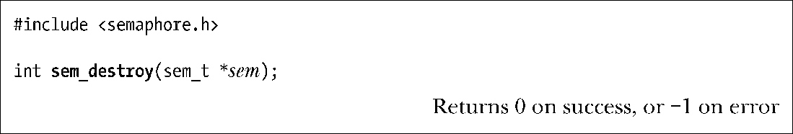

### 53.4.2　销毁一个未命名信号量

sem_destroy()函数将销毁信号量sem，其中sem必须是一个之前使用sem_init()进行初始化的未命名信号量。只有在不存在进程或线程在等待一个信号量时才能够安全销毁这个信号量。

当使用sem_destroy()销毁了一个未命名信号量之后就能够使用sem_init()来重新初始化这个信号量了。

一个未命名信号量应该在其底层的内存被释放之前被销毁。例如，如果信号量一个自动分配的变量，那么在其宿主函数返回之前就应该销毁这个信号量。如果信号量位于一个POSIX共享内存区域中，那么在所有进程都使用完这个信号量以及在使用shm_unlink()对这个共享内存对象执行断开链接操作之前应该销毁这个信号量。

在一些实现上，省略sem_destroy()调用不会导致问题的发生，但在其他实现上，不调用sem_destroy()会导致资源泄露。可移植的应用程序应该调用sem_destroy()以避免此类问题的发生。

