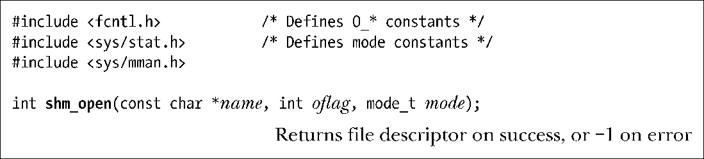
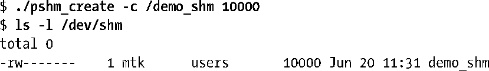
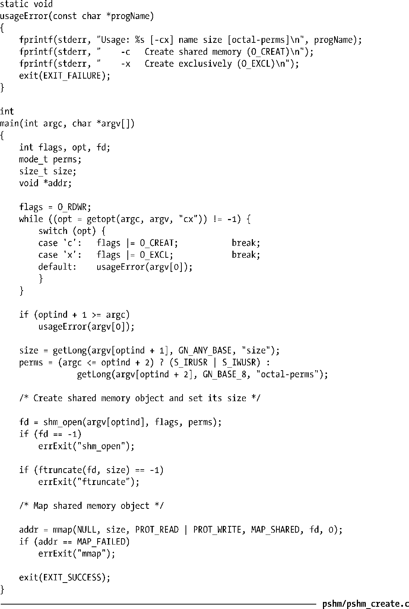

### 54.2　创建共享内存对象

shm_open()函数创建和打开一个新的共享内存对象或打开一个既有对象。传入shm_open()的参数与传入open()的参数类似。

name参数标识出了待创建或待打开的共享内存对象。oflag参数是一个改变调用行为的位掩码，表54-1对这个参数的取值进行了总结。

<b class="my_markdown">表54-1：shm_open() oflag参数的位值</b>

| 标　　记 | 描　　述 |
| :-----  | :-----  | :-----  | :-----  |
| O_CREAT | O_EXCL | 对象不存在时创建对象 | 与O_CREAT互斥地创建对象 |
| O_RDONLY | O_RDWR | 打开只读访问 | 打开读写访问 |
| O_TRUNC | 将对象长度截断为零 |

oflag参数的用途之一是确定是打开一个既有的共享内存对象还是创建并打开一个新对象。如果oflag中不包含O_CREAT，那么就打开一个既有对象。如果指定了O_CREAT，那么在对象不存在时就创建对象。同时指定O_EXCL和O_CREAT能够确保调用者是对象的创建者，如果对象已经存在，那么就返回一个错误（EEXIST）。

oflag参数还表明了调用进程在共享内存对象上的访问模式，其取值为O_RDONLY或O_RDWR。

剩下的标记值O_TRUNC会导致在成功打开一个既有共享内存对象之后将对象的长度截断为零。

> 在Linux上，截断在只读打开时也会发生。但SUSv3声称使用O_TRUNC进行一个只读打开操作的结果是未定义的，因此在这种情况下无法可移植地依赖于某个特定的行为。

在一个新共享内存对象被创建时，其所有权和组所有权将根据调用shm_open()的进程的有效用户和组ID来设定，对象权限将会根据mode参数中设置的掩码值来设定。mode参数能取的位值与文件上的权限位值是一样的（表15-4）。与open()系统调用一样，mode中的权限掩码将会根据进程的umask（15.4.6节）来取值。与open()不同的是，在调用shm_open()时总是需要mode参数，在不创建新对象时需要将这个参数值指定为0。

shm_open()返回的文件描述符会设置close-on-exec标记（FD_CLOEXEC，27.4节），因此当程序执行了一个exec()时文件描述符会被自动关闭。（这与在执行exec()时映射会被解除的事实是一致的。）

一个新共享内存对象被创建时其初始长度会被设置为0。这意味着在创建完一个新共享内存对象之后通常在调用mmap()之前需要调用ftruncate()（5.8节）来设置对象的大小。在调用完mmap()之后可能还需要使用ftruncate()来根据需求扩大或收缩共享内存对象，但需要记住在49.4.3节讨论过的各个要点。

在扩展一个共享内存对象时，新增加的字节会自动被初始化为0。

在任何时候都可以在shm_open()返回的文件描述符上使用fstat()（15.1节）以获取一个stat结构，该结构的字段会包含与这个共享内存对象相关的信息，包括其大小（st_size）、权限（st_mode）、所有者（st_uid）以及组（st_gid）。（这些字段是SUSv3唯一要求fstat()在stat结构中设置的字段，但Linux还会在时间字段中返回有意义的信息，并且会在剩下的字段中返回各种用处稍小一点的信息。）

使用fchmod()和fchown()能够分别修改共享内存对象的权限和所有权。

#### 示例程序

程序清单54-1提供了一个简单的使用shm_open()、ftruncate()以及mmap()的例子。这个程序创建了一个大小通过命令行参数指定的共享内存对象并将该对象映射进进程的虚拟地址空间。（映射这一步是多余的，因为实际上不会对共享内存做任何操作，这里仅仅是为了演示如何使用mmap()。）这个程序允许使用命令行选项来选择shm_open()调用使用的标记（O_CREAT和O_EXCL）。

下面的例子使用这个程序创建了一个10000字节的共享内存对象，然后在/dev/shm中使用ls命令显示出了这个对象。

程序清单54-1：创建一个POSIX共享内存对象

