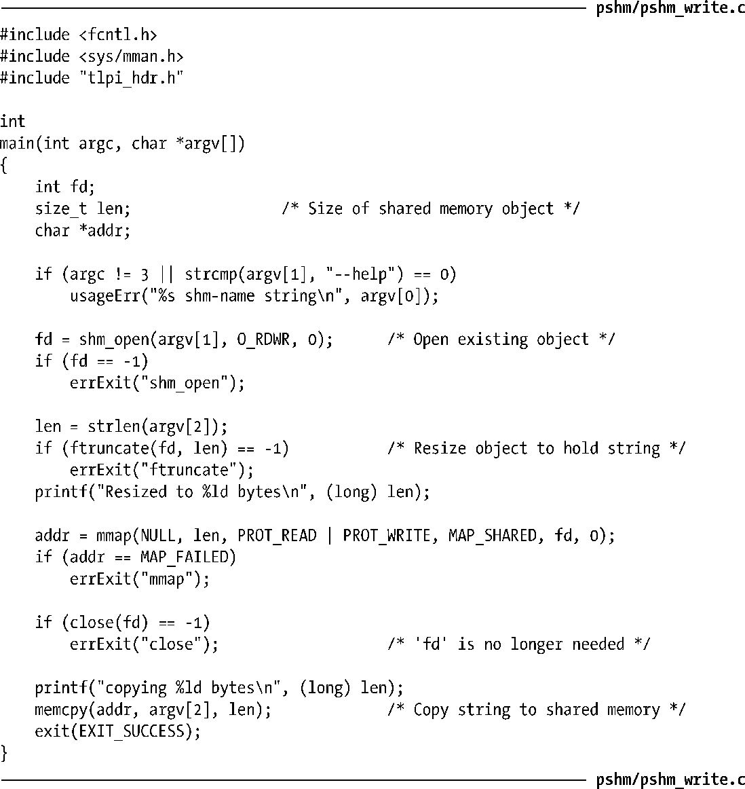
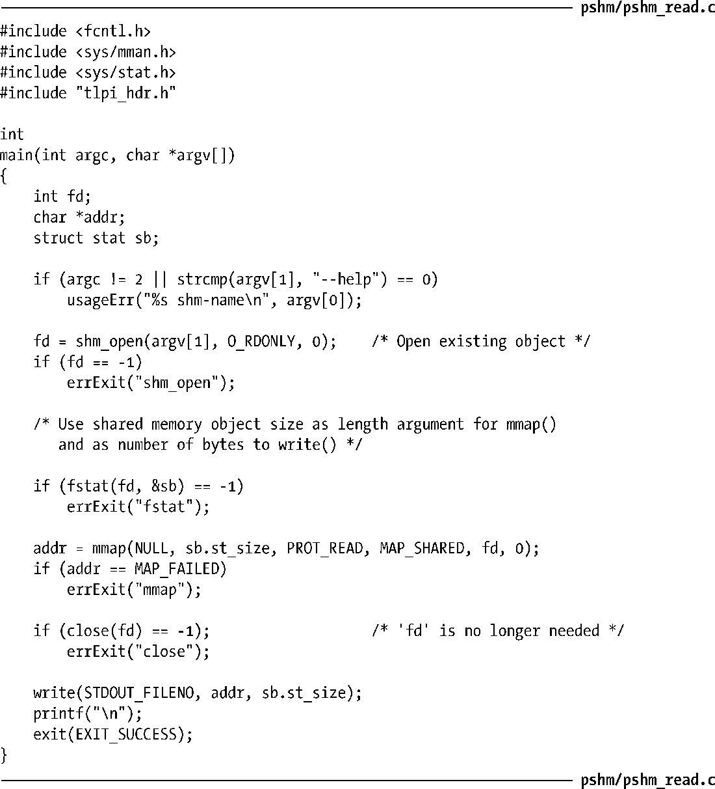
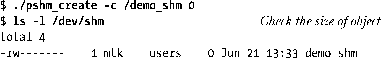
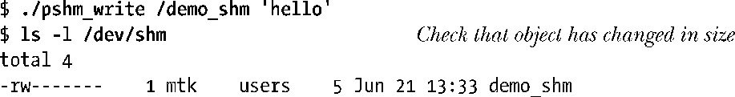

### 54.3　使用共享内存对象

程序清单54-2和程序清单54-3演示了如何使用一个共享内存对象将数据从一个进程传输到另一个进程中。程序清单54-2将其第二个命令行参数中包含的字符串复制到了一个名字通过其第一个命令行参数指定的既有共享内存对象中。在映射这个对象和执行复制之前，这个程序使用了ftruncate()来将共享内存对象的长度设置为与待复制的字符串的长度一样。

程序清单54-2：将数据复制进一个POSIX共享内存对象

程序清单54-3中的程序在标准输出上显示了名字通过其命令行参数指定的既有共享内存对象中的字符串。在调用shm_open()之后，这个程序使用了fstat()来确定共享内存的大小并在映射该对象的mmap()调用中和打印这个字符串的write()调用中使用这个值。

程序清单54-3：从一个POSIX共享内存对象中复制数据

下面的shell会话演示了如何使用程序清单54-2和程序清单54-3中的程序。首先使用程序清单54-1中的程序创建了一个长度为零的共享内存对象。

然后使用程序清单54-2中的程序将一个字符串复制进共享内存对象。

从上面的输出中可以看出这个程序重新设定了共享内存对象的大小使之具备足够的空间来存储指定的字符串。

最后使用程序清单54-3中的程序来显示共享内存对象中的字符串。

应用程序通常需要使用一些同步技术来让进程协调它们对共享内存的访问。在这里给出的示例shell会话中，这种协调是通过用户一个一个运行这些程序来完成的。通常，应用程序会使用一种同步原语（如信号量）来协调对共享内存对象的访问。

