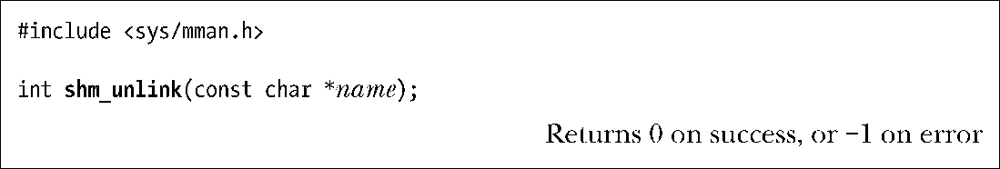
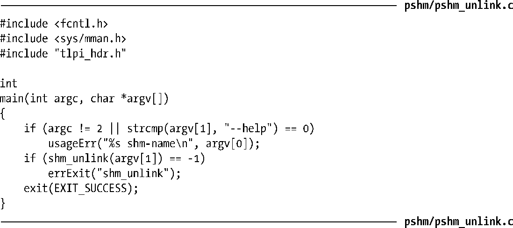

### 54.4　删除共享内存对象

SUSv3要求POSIX共享内存对象至少具备内核持久性，即它们会持续存在直到被显式删除或系统重启。当不再需要一个共享内存对象时就应该使用shm_unlink()删除它。

shm_unlink()函数会删除通过name指定的共享内存对象。删除一个共享内存对象不会影响对象的既有映射（它会保持有效直到相应的进程调用munmap()或终止），但会阻止后续的shm_open()调用打开这个对象。一旦所有进程都解除映射这个对象，对象就会被删除，其中的内容会丢失。

程序清单54-4中的程序使用shm_unlink()来删除通过程序的命令行参数指定的共享内存对象。

程序清单54-4：使用shm_unlink()来断开链接一个POSIX共享内存对象

