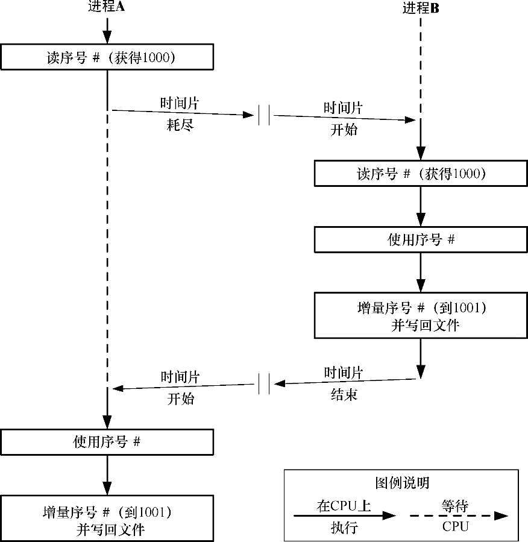

### 55.1　概述

应用程序的一个常见需求是从一个文件中读取一些数据，修改这些数据，然后将这些数据写回文件。只要在一个时刻只有一个进程以这种方式使用文件就不会存在问题，但当多个进程同时更新一个文件时问题就出现了。假设各个进程按照下面的顺序来更新一个包含了一个序号的文件。

1．从文件中读取序号。

2．使用这个序号完成应用程序定义的任务。

3．递增这个序号并将其写回文件。

这里存在的问题是两个进程在没有采用任何同步技术的情况下可能会同时执行上面的步骤，从而导致（举例）出现图55-1中给出的结果（这里假设序号的初始值为1000）。

<b class="my_markdown">图55-1：两个进程在无同步的情况下同时更新一个文件</b>

问题很明显：在执行完上述步骤之后，文件中包含的值为1001，但其所包含的值应该是1002。（这是一种竞争条件。）为防止出现这种情况就需要采用某种形式的进程间同步。

尽管可以使用（比如说）信号量来完成所需的同步，但通常文件锁更好一些，因为内核能够自动将锁与文件关联起来。

> [Stevens & Rago, 2005]声称第一个UNIX文件加锁实现可追溯到1980年，并指出本章着重介绍的fcntl()加锁函数于1984年出现在了System V Release 2中。

本章将介绍两组不同的给文件加锁的API。

+ flock()对整个文件加锁。
+ fcntl()对一个文件区域加锁。

flock()系统调用源自BSD，而fcntl()则源自System V。

使用flock()和fcntl()的常规方法如下。

1．给文件加锁。

2．执行文件I/O。

3．解锁文件使得其他进程能够给文件加锁。

尽管文件加锁通常会与文件I/O一起使用，但也可以将其作为一项更通用的同步技术来使用。协作进程可以约定一个进程对整个文件或一个文件区域进行加锁表示对一些共享资源（如一个共享内存区域）而非文件本身的访问。

#### 混合使用加锁和stdio函数

由于stdio库会在用户空间进行缓冲，因此在混合使用stdio函数与本章介绍的加锁技术时需要特别小心。这里的问题是一个输入缓冲器在被加锁之前可能会被填满或者一个输出缓冲器在锁被删除之后可能会被刷新。要避免这些问题则可以采用下面这些方法。

+ 使用read()和write()（以及相关的系统调用）取代stdio库来执行文件I/O。
+ 在对文件加锁之后立即刷新stdio流，并且在释放锁之前立即再次刷新这个流。
+ 使用setbuf()（或类似的函数）来禁用stdio缓冲，当然这可能会牺牲一些效率。

#### 劝告式和强制式加锁

在本章剩余的部分中会将锁分成劝告式和强制式两种。在默认情况下，文件锁是劝告式的，这表示一个进程可以简单地忽略另一个进程在文件上放置的锁。要使得劝告式加锁模型能够正常工作，所有访问文件的进程都必须要配合，即在执行文件I/O之前首先需要在文件上放置一把锁。与之对应的是，强制式加锁系统会强制一个进程在执行I/O时需要遵从其他进程持有的锁。在55.4节中将会对这两种锁之间的差别进行详细介绍。

