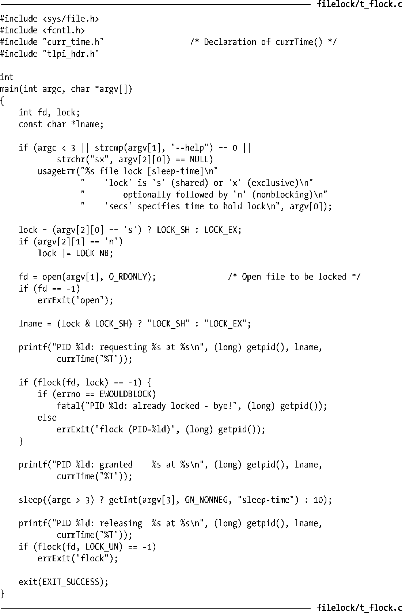
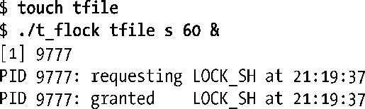
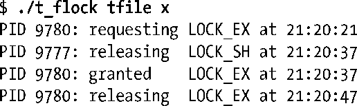

### 55.2　使用flock()给文件加锁

尽管fcntl()提供的功能涵盖了flock()提供的功能，但这里仍然需要对其进行介绍，因为在一些应用程序中仍然使用着flock()并且其在继承和锁释放方面的一些语义与fcntl()是不同的。

flock()系统调用在整个文件上放置一个锁。待加锁的文件是通过传入fd的一个打开着的文件描述符来指定的。operation参数指定了表55-1中描述的LOCK_SH、LOCK_EX以及LOCK_UN值中的一个。

在默认情况下，如果另一个进程已经持有了文件上的一个不兼容的锁，那么flock()会阻塞。如果需要防止出现这种情况，那么可以在operation参数中对这些值取OR（|）。在这种情况下，如果另一个进程已经持有了文件上的一个不兼容的锁，那么flock()就不会阻塞，相反它会返回−1并将errno设置成EWOULDBLOCK。

<b class="my_markdown">表55-1：flock()中operation参数的可取值</b>

| 值 | 描　　述 |
| :-----  | :-----  | :-----  | :-----  |
| LOCK_SH | LOCK_EX | 在fd引用的文件上放置一把共享锁 | 在fd引用的文件上放置一把互斥锁 |
| LOCK_UN | LOCK_NB | 解锁fd引用的文件 | 发起一个非阻塞锁请求 |

任意数量的进程可同时持有一个文件上的共享锁，但在同一个时刻只有一个进程能够持有一个文件上的互斥锁。（换句话说，互斥锁会拒绝其他进程的互斥和共享锁请求。）表55-2对flock()锁的兼容规则进行了总结。这里假设进程A首先放置了锁，表中给出了进程B是否能够放置一把锁。

<b class="my_markdown">表55-2：flock()加锁类型的兼容性</b>

| 进程A | 进程B |
| :-----  | :-----  | :-----  | :-----  |
| LOCK_SH | LOCK_EX |
| LOCK_SH | LOCK_EX | 是 | 否 | 否 | 否 |

不管一个进程在文件上的访问模式是什么（读、写、或读写），它都可以在文件上放置一把共享锁或互斥锁。

通过再次调用flock()并在operation参数中指定恰当的值可以将一个既有共享锁转换成一个互斥锁（反之亦然）。将一个共享锁转换成一个互斥锁，在另一个进程持有了文件上的共享锁时会阻塞，除非同时指定了LOCK_NB标记。

锁转换的过程不一定是原子的。在转换过程中首先会删除既有的锁，然后创建一个新锁。在这两步之间另一个进程对一个不兼容锁的未决请求可能会得到满足。如果发生了这种情况，那么转换过程会被阻塞，或者在指定了LOCK_NB的情况下转换过程会失败并且进程会丢失其原先持有的锁。（在最初的BSD flock()实现和很多其他UNIX实现上会出现这种行为。）

> 尽管这不是SUSv3的一部分，但大多数UNIX实现都提供了flock()。一些实现要求包含<fcntl.h>或<sys/fcntl.h>，而不是<sys/file.h>。由于flock()源自BSD，因此这个函数所施加的锁有时候会被称为BSD文件锁。

程序清单55-1演示了如何使用flock()。这个程序首先对一个文件加锁，睡眠指定的秒数，然后对文件解锁。程序接收三个命令行参数，其中第一个参数是待加锁的文件，第二个参数指定了锁的类型（共享或互斥）以及是否包含LOCK_NB（非阻塞）标记，第三个参数指定了在获取和释放锁之间睡眠的秒数，并且这个参数是可选的，其默认值是10秒。

程序清单55-1：使用flock()

使用程序清单55-1中的程序可以开展一些实验来研究flock()的行为。下面的shell会话给出了其中一些例子。下面首先创建了一个文件，然后在后台启动一个程序实例并持有一个共享锁60秒。

接着启动另一个能够成功请求一个共享锁的程序实例，然后释放这个共享锁。

但当启动另一个程序实例来非阻塞地请求一个互斥锁时就会立即失败。

当启动另一个程序实例来阻塞地请求一个互斥锁时程序就会阻塞。当原来持有共享锁的后台进程在60秒后释放这个锁之后，被阻塞的请求就会得到满足。

