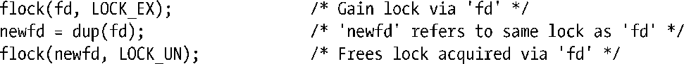
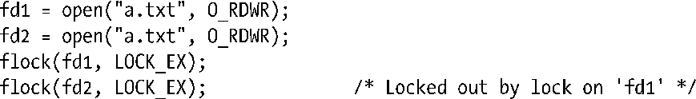

### 55.2.1　锁继承与释放的语义

根据表55-1，通过flock()调用并将operation参数指定为LOCK_UN可以释放一个文件锁。此外，锁会在相应的文件描述符被关闭之后自动被释放。但问题其实要更加复杂，通过flock()获取的文件锁是与打开的文件描述（5.4节）而不是文件描述符或文件（i-node）本身相关联的。这意味着当一个文件描述符被复制时（通过dup()、dup2()或一个fcntl() F_DUPFD操作），新文件描述符会引用同一个文件锁。例如，如果获取了fd所引用的文件上的一个锁，那么下面的代码（忽略了错误检查）会释放这个锁。

如果已经通过了一个特定的文件描述符获取了一个锁并创建了该文件描述符的一个或多个副本，那么——如果不显式地执行一个解锁操作——只有当所有的描述符副本都被关闭之后锁才会被释放。

如果使用open()获取第二个引用同一个文件的文件描述符（以及关联的打开的文件描述），那么flock()会将第二个描述符当成是一个不同的描述符。例如执行下面这些代码的进程会在第二个flock()调用上阻塞。

这样一个进程就能使用flock()来将自己锁在一个文件之外。读者稍后就会看到，使用fcntl()返回的记录锁是无法取得这种效果的。

当使用fork()创建一个子进程时，这个子进程会复制其父进程的文件描述符，并且与使用dup()调用之类的函数复制的描述符一样，这些描述符会引用同一个打开的文件描述，进而会引用同一个锁。例如下面的代码会导致一个子进程删除一个父进程的锁。

有时候可以利用这些语义来将一个文件锁从父进程（原子地）传输到子进程：在fork()之后，父进程关闭其文件描述符，然后锁就只在子进程的控制之下了。读者稍后就会看到使用fcntl()返回的记录锁是无法取得这种效果的。

通过flock()创建的锁在exec()中会得到保留（除非在文件描述符上设置了close-on-exec标记并且该文件描述符是最后一个引用底层的打开的文件描述的描述符）。

上面描述的flock()在Linux上的语义与其在经典的BSD实现上的语义是一致的。在一些UNIX实现上，flock()是使用fcntl()实现的，读者稍后就会看到fcntl()锁的继承和释放语义与flock()锁的继承和释放语义是不同的。由于flock()创建的锁与fcntl()创建的锁之间的交互是未定义的，因此应用程序应该只使用其中一种文件加锁方法。

