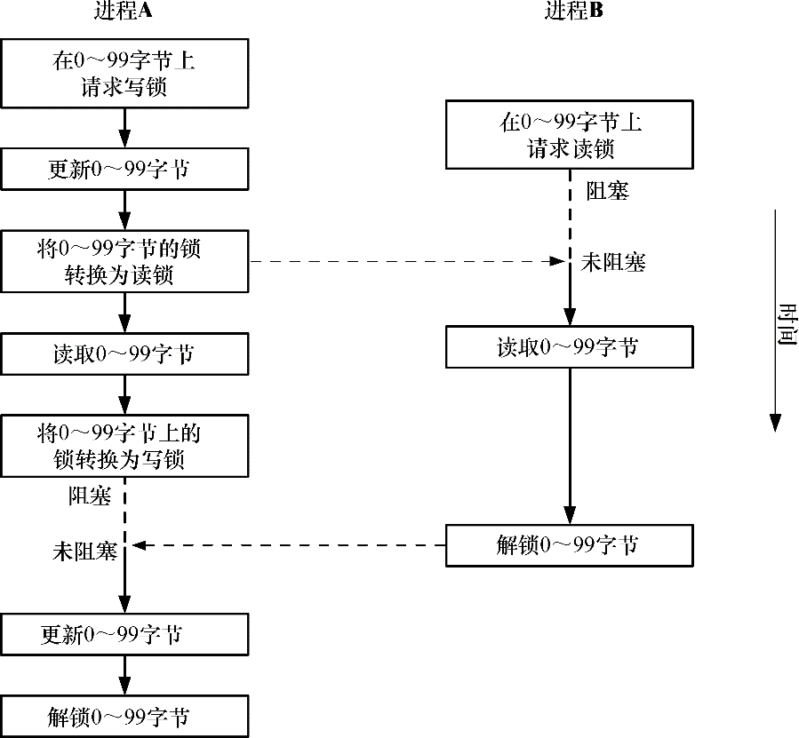
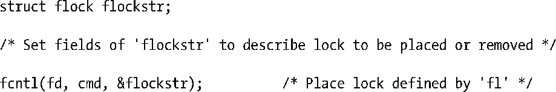
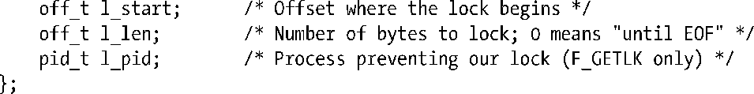
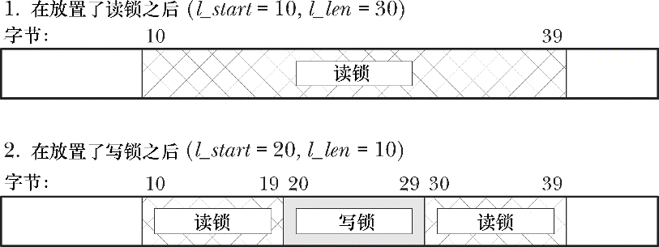

### 55.3　使用fcntl()给记录加锁

使用fcntl()（5.2节）能够在一个文件的任意部分上放置一把锁，这个文件部分既可以是一个字节，也可以是整个文件。这种形式的文件加锁通常被称为记录加锁，但这种称谓是不恰当的，因为UNIX系统上的文件是一个字节序列，并不存在记录边界的概念，文件记录的概念只存在于应用程序中。

一般来讲，fcntl()会被用来锁住文件中与应用程序定义的记录边界对应的字节范围，这也是术语记录加锁的由来。术语字节范围、文件区域以及文件段很少被用到，但它们更加精确地描述了这种锁。（由于这是唯一一种在最初的POSIX.1标准和SUSv3中予以规定的加锁技术，因此它有时候也被称为POSIX文件加锁。）

> SUSv3要求普通文件支持记录加锁，同时也允许其他文件类型也支持文件加锁。尽管记录锁通常只有在应用于普通文件上时才有意义（因为对于大多数其他文件类型，讨论文件中所包含的数据的字节范围是毫无意义的），但是在Linux上可以将一个记录锁应用在任意类型的文件描述符上。

图55-2显示了如何使用记录锁来同步两个进程对一个文件中的同一块区域的访问。（在这幅图中假设所有的锁请求都会阻塞，这样它们在锁被另一个进程持有时就会等待。）

<b class="my_markdown">图55-2：使用记录锁同步对一个文件的同一区域的访问</b>

用来创建或删除一个文件锁的fcntl()调用的常规形式如下。

fd参数是一个打开着的文件描述符，它引用了待加锁的文件。

在讨论cmd参数之前首先描述一下flock结构。

#### flock结构

flock结构定义了待获取或删除的锁，其定义如下所示。

l_type字段表示需放置的锁的类型，其取值为表55-3中列出的值中的一个。

从语义上来讲，读（F_RDLCK）和写（F_WRLCK）锁对应于flock()施加的共享锁和互斥锁，并且它们遵循着同样的兼容性规则（表55-2）：任何数量的进程能够持有一块文件区域上的读锁，但只有一个进程能够持有一把写锁，并且这把锁会将其他进程的读锁和写锁排除在外。将l_type指定为F_UNLCK类似于flock() LOCK_UN操作。

<b class="my_markdown">表55-3：fcntl()加锁的锁类型</b>

| 锁 的 类 型 | 描　　述 |
| :-----  | :-----  | :-----  | :-----  |
| F_RDLCK | F_WRLCK | F_UNLCK | 放置一把读锁 | 放置一把写锁 | 删除一把既有锁 |

为了在一个文件上放置一把读锁就必须要打开文件以允许读取。类似地，要放置一把写锁就必须要打开文件以允许写入。要放置两种锁就必须要打开文件以允许读写（O_RDWR）。试图在文件上放置一把与文件访问模式不兼容的锁将会导致一个EBADF错误。

l_whence、l_start以及l_len字段一起指定了待加锁的字节范围。前两个字段类似于传入lseek()的whence和offset参数（4.7节）。l_start字段指定了文件中的一个偏移量，其具体含义需根据下列规则来解释。

+ 当l_whence为SEEK_SET时，为文件的起始位置。
+ 当l_whence为SEEK_CUR时，为当前的文件偏移量。
+ 当l_whence为SEEK_END时，为文件的结尾位置。

在后两种情况中，l_start可以是一个负数，只要最终得到的文件位置不会小于文件的起始位置（字节0）即可。

l_len字段包含一个指定待加锁的字节数的整数，其起始位置由l_whence和l_start定义。对文件结尾之后并不存在的字节进行加锁是可以的，但无法对在文件起始位置之前的字节进行加锁。

从内核2.4.21开始，Linux允许在l_len中指定一个负值。这是请求对在l_whence和l_start指定的位置之前的l_len字节（即范围在(l_start – abs(l_len))到(l_start – 1)之间的字节）进行加锁。SUSv3允许但并没有要求这种特性，其他几个UNIX实现也提供了这个特性。

一般来讲，应用程序应该只对所需的最小字节范围进行加锁，这样其他进程就能够同时对同一个文件的不同区域进行加锁，进而取得更大的并发性。

> 在某些情况下需要对术语最小范围进行限定。在诸如NFS和CIFS之类的网络文件系统上混合使用记录锁和mmap()调用会导致不期望的结果。之所以会发生这种问题是因为mmap()映射文件的单位是系统分页大小。如果一个文件锁是分页对齐的，那么所有一切都会正常工作，因为锁会覆盖与一个脏分页对应的整个区域。但如果锁没有分页对齐，那么就会存在一种竞争条件——当映射分页的任意部分发生变更之后内核可能就会写入未被锁覆盖的区域。

将l_len指定为0具有特殊含义，即“对范围从由l_start和l_whence确定的起始位置到文件结尾位置之内的所有字节加锁，不管文件增长到多大”。这种处理方式在无法提前知道向一个文件中加入多少字节的情况下是比较方便的。要锁住整个文件则可以将l_whence指定为SEEK_SET，并将l_start和l_len都指定为0。

#### cmd参数

fcntl()在操作文件锁时其cmd参数的可取值有以下三个，其中前两个值用来获取和释放锁。

##### F_SETLK

获取（l_type是F_RDLCK或F_WRLCK）或释放（l_type是F_UNLCK）由flockstr指定的字节上的锁。如果另一个进程持有了一把待加锁的区域中任意部分上的不兼容的锁时，fcntl()就会失败并返回EAGAIN错误。在一些UNIX实现上fcntl()在碰到这种情况时会失败并返回EACCES错误。SUSv3允许实现采用其中任意一种处理方式，因此可移植的应用程序应该对这两个值都进行测试。

##### F_SETLKW

这个值与F_SETLK是一样的，除了在有另一个进程持有一把待加锁的区域中任意部分上的不兼容的锁时，调用就会阻塞直到锁的请求得到满足。如果正在处理一个信号并且没有指定SA_RESTART（21.5节），那么F_SETLKW操作就可能会被中断（即失败并返回EINTR错误）。开发人员可以利用这种行为来使用alarm()或setitimer()为一个加锁请求设置一个超时时间。

注意，fcntl()要么会锁住指定的整个区域，要么就不会对任何字节加锁，这里并不存在只锁住请求区域中那些当前未被锁住的字节的概念。

剩下的一个fcntl()操作可用来确定是否可以在一个给定的区域上放置一把锁。

##### F_GETLK

检测是否能够获取flockstr指定的区域上的锁，但实际不获取这把锁。l_type字段的值必须为F_RDLCK或F_WRLCK。flockstr结构是一个值-结果参数，在返回时它包含了有关是否能够放置指定的锁的信息。如果允许加锁（即在指定的文件区域上不存在不兼容的锁），那么在l_type字段中会返回F_UNLCK，并且剩余的字段会保持不变。如果在区域上存在一个或多个不兼容的锁，那么flockstr会返回与那些锁中其中一把锁（无法确定是哪把锁）相关的信息，包括其类型（l_type）、字节范围（l_start和l_len；l_whence总是返回为SEEK_SET）以及持有这把锁的进程的进程ID（l_pid）。

注意，在使用F_GETLK之后接着使用F_SETLK或F_SETLKW的话就可能会出现竞争条件，因为在执行后面一个操作时，F_GETLK返回的信息可能已经过时了，因此F_GETLK的实际作用比其一开始看起来的作用要小很多。即使F_GETLK表示可以放置一把锁，仍然需要为F_SETLK返回一个错误或F_SETLKW阻塞做好准备。

> GNU C库还实现了函数lockf()，它仅仅是一个基于fcntl()的简化接口。（SUSv3规定了lockf()，但并没有规定lockf()与fcntl()之间的关系。在大多数UNIX系统上，lockf()的实现都是基于fcntl()的。）形如lockf(fd, operation, size)的调用等价于在调用fcntl()时将l_whence设置为SEEK_CUR，l_start设置为0，以及将l_len设置为size，即lockf()将会锁住从当前文件偏移量开始到文件结束的字节序列。lockf()的operation参数类似于fcntl()的cmd参数，但用于获取、释放以及测试锁的存在性的常量值是不同的。lockf()函数只放置互斥锁。更多细节请参考lockf(3)手册。

#### 锁获取和释放的细节

有关获取和释放由fcntl()创建的锁方面需要注意以下几点。

+ 解锁一块文件区域总是会立即成功。即使当前并不持有一块区域上的锁，对这块区域解锁也不是一个错误。
+ 在任何一个时刻，一个进程只能持有一个文件的某个特定区域上的一种锁。在之前已经锁住的区域上放置一把新锁会导致不发生任何事情（新锁的类型与既有锁的类型是一样的）或原子地将既有锁转换成新模式。在后一种情况中，当将一个读锁转换成写锁时需要为调用返回一个错误（F_SETLK）或阻塞（F_SETLKW）做好准备。（这与flock()是不同的，它的锁转换不是原子的。）
+ 一个进程永远都无法将自己锁在一个文件区域之外，即使通过多个引用同一文件的文件描述符放置锁也是如此。（这与flock()是不同的，在55.3.5节中将会介绍更多有关这方面的信息。）
+ 在已经持有的锁中间放置一把模式不同的锁会产生三把锁：在新锁的两端会创建两个模式为之前模式的更小一点的锁（参见图55-3）。与此相反的是，获取与模式相同的一把既有锁相邻或重叠的第二把锁会产生单个覆盖两把锁的合并区域的聚合锁。除此之外，还存在其他的组合情况。如对一个大型既有锁的中间的一个区域进行解锁会在已解锁区域的两端产生两个更小一点的已锁住区域。如果一个新锁与一个模式不同的既有锁重叠了，那么既有锁就会收缩，因为重叠的字节会合并进新锁中。

<b class="my_markdown">图55-3：在同一个进程中使用一把写锁分割一个既有读锁</b>

+ 在文件区域锁方面，关闭一个文件描述符具备一些不寻常的语义，在55.3.5节将会对这些语义进行介绍。

