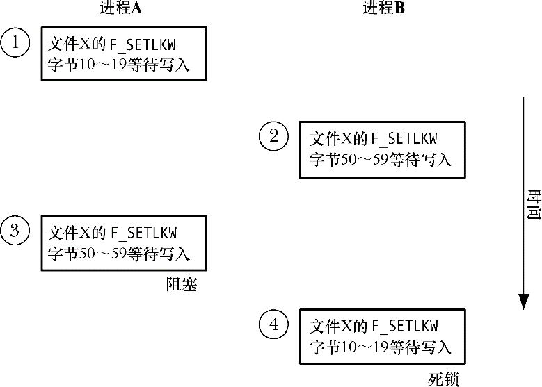

### 55.3.1　死锁

在使用F_SETLKW时需要弄清楚图55-4中阐述的场景类别。在这种场景中，每个进程的第二个锁请求会被另一个进程持有的锁阻塞。这种场景被称为死锁。如果内核不对这种情况进行抑制，那么会导致两个进程永远阻塞。为避免这种情况，内核会对通过F_SETLKW发起的每个新锁请求进行检查以判断是否会导致死锁。如果会导致死锁，那么内核就会选中其中一个被阻塞的进程使其fcntl()调用解除阻塞并返回错误EDEADLK。（在Linux上，进程会选中最近的fcntl()调用，但SUSv3并没有要求这种行为，并且这种行为在后续的Linux版本或其他UNIX实现上可能不成立。使用F_SETLKW的所有进程都必须要为处理EDEADLK错误做好准备。）

<b class="my_markdown">图55-4：当两个进程拒绝对方的加锁请求时会死锁</b>

即使在多个不同的文件上放置锁时也能检测出死锁情形，即涉及多个进程的循环死锁。（举个例子，对于循环死锁，意味着进程A等待获取被进程B锁住的区域上的锁，进程B等待进程C持有的锁，进程C等待进程A持有的锁。）

