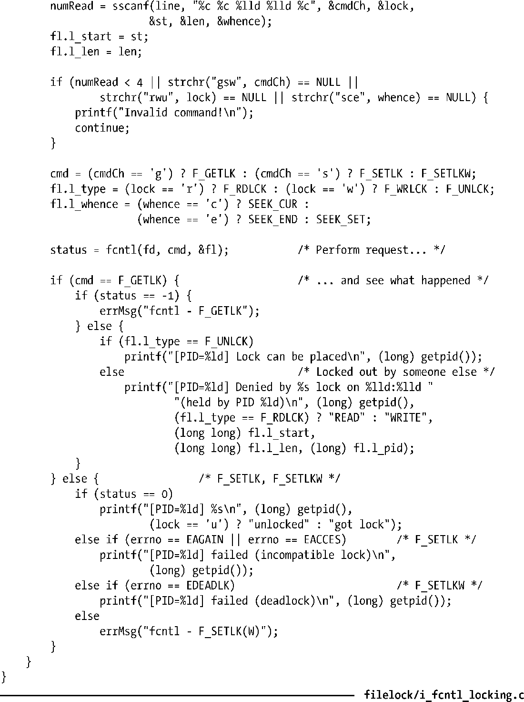
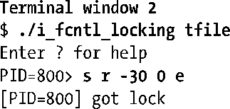
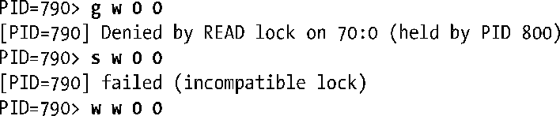
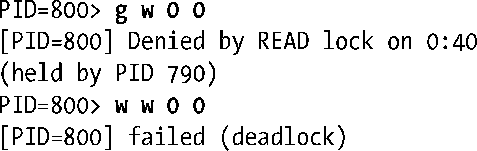
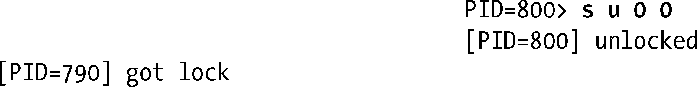

### 55.3.2　示例：一个交互式加锁程序

程序清单55-2中的程序允许交互式地试验记录加锁。这个程序接收一个命令行参数：待加锁的文件的名称。使用这个程序能够验证很多之前介绍的有关记录加锁操作的论断。这个程序被设计成了一个交互式程序并接收形如下面的命令。

在cmd参数中可以指定g来执行一个F_GETLK，指定s来执行一个F_SETLK，或指定w来执行一个F_SETLKW。剩下的参数用来初始化传入fcntl()的flock结构。lock参数指定了l_type字段的取值，其中r表示F_RDLCK，w表示F_WRLCK，u表示F_UNLCK。start和length参数是整数，它们指定了l_start和l_len字段的取值。最后是一个可选的whence参数，它指定了l_whence字段的取值，其中s表示SEEK_SET（默认值），c表示SEEK_CUR，e表示SEEK_END。（至于为何在程序清单55-2的printf()调用中将l_start和l_len字段转换成long long，请参考5.10节。）

程序清单55-2：试验记录加锁

在下面的shell会话日志中演示了如何使用程序清单55-2中的程序，其中运行了两个实例来在同一个大小为100字节的文件（tfile）上放置锁。图55-5给出了shell会话日志中各个点上准予的和排队的加锁请求的状态并在下面的注释中进行的标注。

<b class="my_markdown">图55-5：运行running i_fcntl_locking.c时被准予的和排队的加锁请求的状态</b>

首先启动程序程序清单55-2中的程序的第一个实例（进程A）并在文件中0～39字节区域上放置一把读锁。

接着启动程序的第二个实例（进程B）并在文件中第70个字节到文件结尾的区域上放置一把读锁。

此刻出现了图55-5中a部分的情形，其中进程A（进程ID为790）和进程B（进程ID为800）持有了文件的不同部分上的锁。

现在回到进程A让其尝试在整个文件上放置一把写锁。首先通过F_GETLK检测是否可以加锁并得到存在一个冲突的锁的信息。接着尝试通过F_SETLK放置一把锁，但这个操作也会失败。最后尝试通过F_SETLKW放置一把锁，这次将会阻塞。

此刻出现了图55-5中b部分的情形，其中进程A和进程B分别持有了文件的不同部分上的锁，并且进程A还有一个排着队的对整个文件的加锁请求。

接着继续在进程B中尝试在整个文件上放置一把写锁。首先使用F_GETLK检测一下是否可以加锁并得到存在一个冲突的锁的信息。接着尝试使用F_SETLKW加锁。

图55-5中的c部分给出了当进程B发起一个在整个文件上放置一把写锁的阻塞请求发生的情形：死锁。此刻内核将会选择让其中一个加锁请求失败——在本例中进程B的请求将会被选中并从其fcntl()调用中接收到EDEADLK错误。

接着继续在进程B中删除其在文件上的所有锁。

从上面输出的最后一行中可以看出进程A的被阻塞的加锁请求被准予了。

重要的一点是，需要意识到即使进程B的死锁请求被取消之后它仍然持有了其他的锁，因此进程A的排着队的加锁请求仍然会被阻塞。进程A加锁请求只有在进程B删除了其持有的锁之后才会被准予，这就出现了图55-5中d部分的情形。

