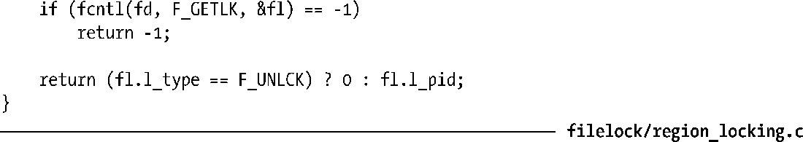

### 55.3.3　示例：一个加锁函数库

程序清单55-3给出了一组在其他程序中可以使用的加锁函数，如下所示。

+ lockRegion()函数使用F_SETLK在文件描述符fd引用的打开着的文件上放置一把锁。type参数指定了锁的类型（F_RDLCK或F_WRLCK）。whence、start以及len参数指定了需加锁的字节范围。这些参数为用来加锁的flockstr结构中名称类似的字段提供了值。
+ lockRegionWait()函数与lockRegion()类似，但它发起的是一个阻塞式加锁请求，即它使用了F_SETLKW而不是F_SETLK。
+ regionIsLocked()函数检测是否可以在一个文件上放置一把锁。这个函数的参数与lockRegion()函数接收的参数是一样的。这个函数在没有进程持有与调用中指定的锁冲突的锁时将返回0。如果存在其中一个进程持有了冲突的锁，那么这个函数就会返回一个非零值（即true）——持有冲突锁的进程的进程ID。

程序清单55-3：文件区域加锁函数

