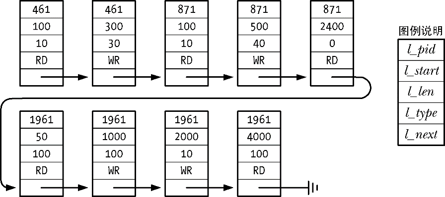

### 55.3.4　锁的限制和性能

SUSv3允许一个实现为所能获取的记录锁的数量设置一个固定的、系统级别的上限。当达到这个限制时，fcntl()就会失败并返回ENOLCK错误。Linux并没有为所能获取的记录锁的数量设置一个固定的上限，至于具体数量则受限于可用的内存数量。（很多其他UNIX实现也采用了类似的做法。）

获取和释放记录锁的速度有多快呢？这个问题没有固定的答案，因为这些操作的速度取决于用来维护记录锁的内核数据结构和具体的某一把锁在这个数据结构中所处的位置。本章稍后就会介绍这个数据结构，在此之前首先来考虑几点能够影响其设计的需求。

+ 内核需要能够将一个新锁和任意位于新锁任意一端的模式相同的既有锁（由同一个进程持有）合并起来。
+ 新锁可能会完全取代调用进程持有的一把或多把既有锁。内核需要容易地定位出所有这些锁。
+ 当在一把既有锁的中间创建一个模式不同的新锁时，分隔既有锁的工作（图55-3）应该是比较简单的。

用来维护锁相关信息的内核数据结构需要被设计成满足这些需求。每个打开着的文件都有一个关联链表，链表中保存着该文件上的锁。列表中的锁会先按照进程ID再按照起始偏移量来排序。图55-6给出了一个这样的列表。

<b class="my_markdown">图55-6：单个文件上的记录锁列表</b>

> 内核在与一个打开着的文件相关联的锁链表中维护着flock()锁与文件租用。（在55.5节中讨论/proc/locks文件时将会对文件租用进行简要介绍。）但这种类型的锁的数量通常要小很多很多，因此不太可能会对性能产生影响，所以在这里的讨论中并没有考虑它们。

每次需要在这个数据结构中添加一把新锁时，内核都必须要检查是否与文件上的既有锁有冲突。这个搜索过程是从列表头开始顺序开展的。

假设有大量的锁随机地分布在很多进程中，那么就可以说，添加或删除一个锁所需的时间与文件上已有的锁的数量之间大概是一个线性关系。

