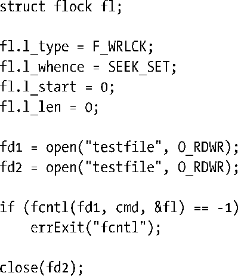

### 55.3.5　锁继承和释放的语义

fcntl()记录锁继承和释放的语义与使用flock()创建的锁的继承和释放的语义是不同的，以下几点需要注意。

+ 由fork()创建的子进程不会继承记录锁。这与flock()是不同的，在使用flock()创建的锁时，子进程会继承一个引用同一把锁的引用并且能够释放这把锁，从而导致父进程也会失去这把锁。
+ 记录锁在exec()中会得到保留。（但需要注意下面描述的close-on-exec标记的作用。）
+ 一个进程中的所有线程会共享同一组记录锁。
+ 记录锁同时与一个进程和一个i-node（参见5.4节）关联。从这种关联关系可以得出一个毫不意外的结果就是当一个进程终止之后，其所有记录锁会被释放。另一个稍微有点出乎意料的结果是当一个进程关闭了一个文件描述符之后，进程持有的对应文件上的所有锁会被释放，不管这些锁是通过哪个文件描述符获得的。例如在下面的代码中，close(fd2)调用会释放调用进程持有的testfile文件之上的锁，尽管这把锁是通过文件描述符fd1获得的。

不管引用同一个文件的各个描述符是如何获得的以及不管描述符是如何被关闭的，上面最后一点中描述的语义都是适用的。例如dup()、dup2()以及fcntl()都可以用来获取一个打开着的文件描述符的副本。除了执行一个显式的close()之外，一个描述符在设置了close-on-exec标记时会被一个exec()调用关闭，或者也可以通过一个dup2()调用来关闭其第二个文件描述符参数，当然前提是该描述符已经被打开了。

fcntl()锁的继承和释放语义是一个架构上的缺陷。例如它们使得使用库包中的记录锁容易发生问题，因为一个库函数无法阻止调用者关闭一个引用了一个被锁住的文件的文件描述符，从而会导致删除一个通过库代码获得的锁。另一种可选的实现方案是将锁与文件描述符关联起来，而不是与i-node关联起来。但之所以采用当前这种语义是存在历史原因的，并且这种语义现在已经变成了记录锁的标准行为。遗憾的是，这些语义会极大地限制fcntl()加锁工具的实用性。

> 在使用flock()时，一把锁只会与一个打开的文件描述关联，并且会持续发挥作用直到持有这把锁的引用的任意进程显式地释放这把锁或所有引用这个打开着的文件描述的文件描述符被关闭之后为止。

